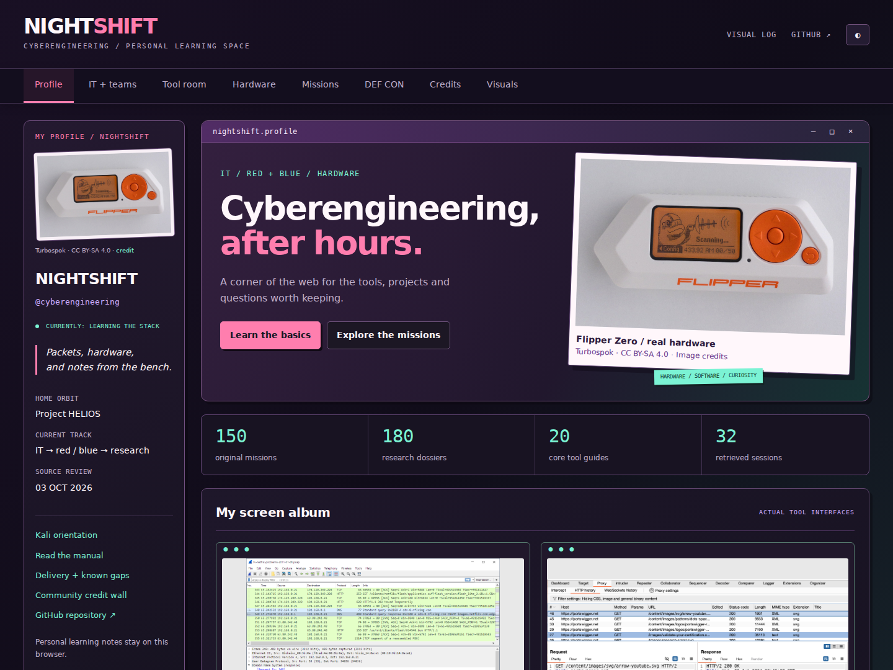
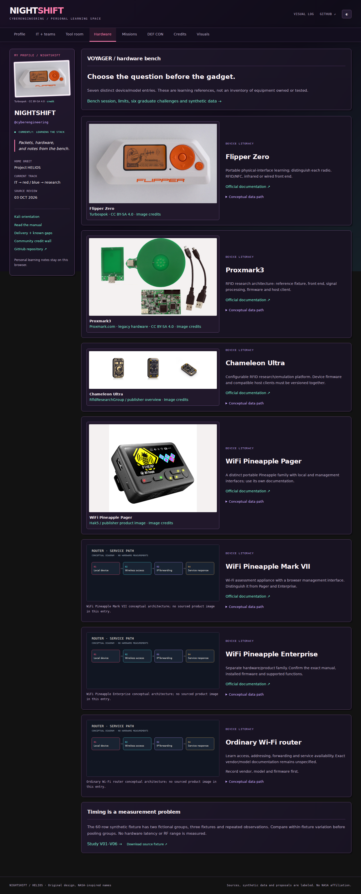
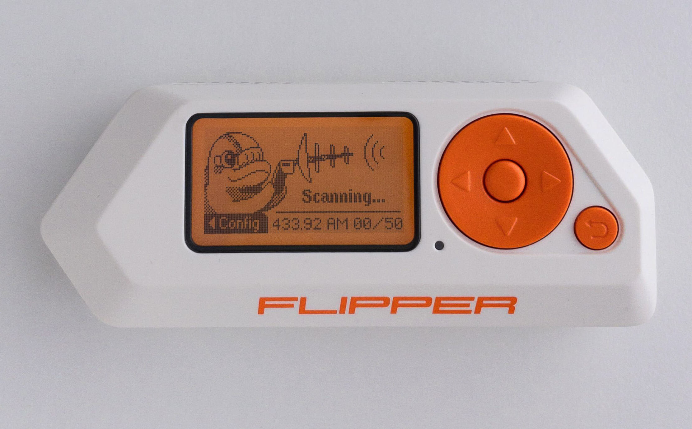
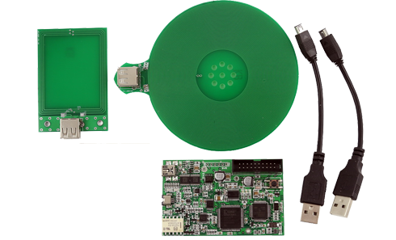
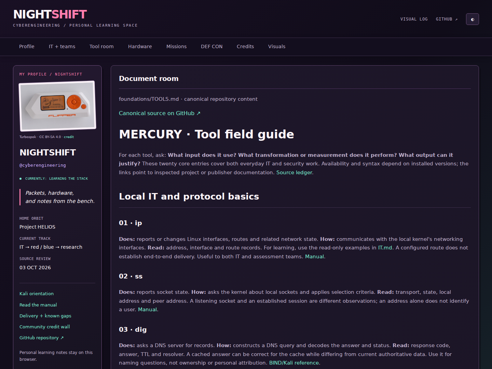
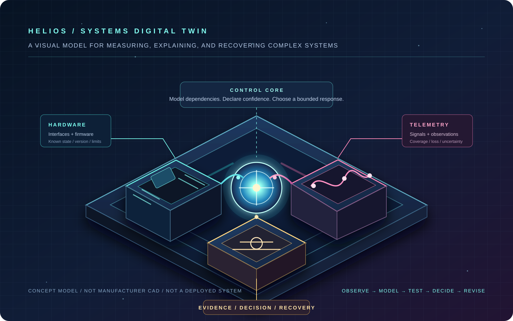
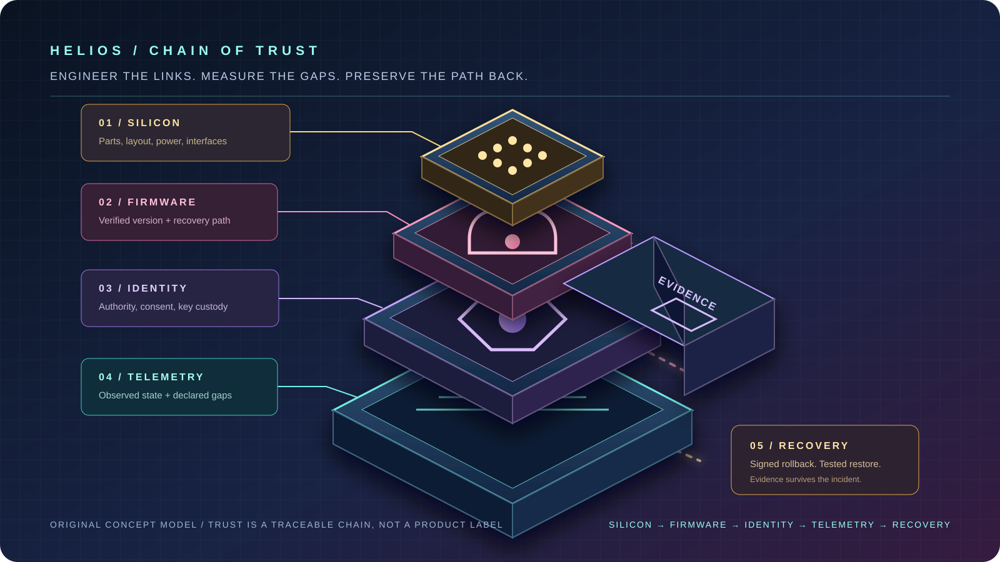
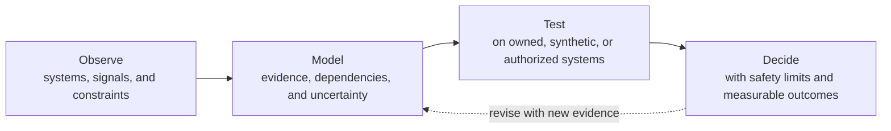

<p align="center">
  <a href="site/README.md">
    
  </a>
</p>

<h1 align="center">PROJECT HELIOS</h1>
<p align="center">
  <strong>A visual, evidence-aware cyberengineering atlas.</strong><br>
  Learn the systems behind secure software, trustworthy hardware, resilient networks, and responsible security research.
</p>

<p align="center">
  <a href="foundations/README.md"><strong>Start learning</strong></a>
  &nbsp;&bull;&nbsp;
  <a href="site/README.md"><strong>Open NIGHTSHIFT</strong></a>
  &nbsp;&bull;&nbsp;
  <a href="research/README.md"><strong>Explore research</strong></a>
  &nbsp;&bull;&nbsp;
  <a href="INDEX.md"><strong>Browse all missions</strong></a>
</p>

> **A research portfolio, not a deployed defense product.** Every exercise and proposal is scoped to owned, synthetic, or explicitly authorized systems. The work documents models, methods, and evaluation plans; it does not claim field effectiveness.

---

## Mission control

<table>
  <tr>
    <td width="50%" valign="top">
      <a href="site/README.md"></a>
      <h3><a href="site/README.md">NIGHTSHIFT: interactive learning portal</a></h3>
      <p>A custom static web experience with a visual profile, searchable missions and tools, a local field notebook, hardware models, conference coverage, and a diagram gallery.</p>
      <p><a href="site/README.md"><strong>Open the portal guide &rarr;</strong></a></p>
    </td>
    <td width="50%" valign="top">
      <a href="hardware/README.md"></a>
      <h3><a href="hardware/README.md">VOYAGER: hardware learning bench</a></h3>
      <p>Real hardware photographs sit beside conceptual architectures for device trust, RF work, firmware recovery, and reproducible bench measurements.</p>
      <p><a href="hardware/README.md"><strong>Visit the hardware bench &rarr;</strong></a></p>
    </td>
  </tr>
</table>

## Inside the lab

<table>
  <tr>
    <td width="33.33%" valign="top">
      <a href="hardware/README.md"></a>
      <h3><a href="hardware/README.md">Physical interfaces</a></h3>
      <p>Use real device imagery as a starting point for questions about interfaces, signals, firmware boundaries, and evidence limits.</p>
      <p><a href="hardware/README.md"><strong>Study the hardware model &rarr;</strong></a></p>
    </td>
    <td width="33.33%" valign="top">
      <a href="hardware/README.md"></a>
      <h3><a href="hardware/README.md">Signals to evidence</a></h3>
      <p>See how radio and RFID research is framed as authorized, reproducible observation rather than a collection of unexplained commands.</p>
      <p><a href="hardware/README.md"><strong>Open the bench protocol &rarr;</strong></a></p>
    </td>
    <td width="33.33%" valign="top">
      <a href="site/reader.html?doc=foundations/TOOLS.md"></a>
      <h3><a href="site/reader.html?doc=foundations/TOOLS.md">Tools with a purpose</a></h3>
      <p>Every field-guide entry explains its input, transformation, output, operating limit, and the manual or primary source behind it.</p>
      <p><a href="foundations/TOOLS.md"><strong>Read the tool field guide &rarr;</strong></a></p>
    </td>
  </tr>
</table>

<sub>Hardware photographs are credited in the <a href="site/IMAGE-CREDITS.md">image ledger</a>. They illustrate supported learning concepts; the repository does not provide unauthorized device-operation instructions.</sub>

## Your flight path

```text
01  FOUNDATION      Build vocabulary, inspect local systems, and learn to read manuals.
        |
02  OBSERVATION     Understand packets, devices, logs, and the limits of each measurement.
        |
03  ENGINEERING     Model trust, provenance, recovery, identity, and resilient operations.
        |
04  EVALUATION      Define a falsifier, measure a result, record uncertainty, and stop safely.
        |
05  RESEARCH        Connect a bounded mission to its evidence, sources, and graduate challenge.
```

| Flight phase | What you will be able to explain | Launch point |
| --- | --- | --- |
| `01 FOUNDATION` | The difference between an interface, protocol, service, process, packet, and claim | [MERCURY Foundations](foundations/README.md) |
| `02 OBSERVATION` | What a tool or device actually measures, and what it cannot establish | [Tool field guide](foundations/TOOLS.md) |
| `03 ENGINEERING` | How security constraints are designed into software, hardware, and operations | [Mission Systems & Architecture](atlas/01-mission-systems-and-architecture.md) |
| `04 EVALUATION` | How to turn a concept into an authorized, falsifiable experiment | [Research method](editorial/RESEARCH_METHOD.md) |
| `05 RESEARCH` | How advanced missions connect to models, resources, and open challenges | [Research Flightbook](research/README.md) |

| Begin with a question | Click through |
| --- | --- |
| **I am new to IT or security.** Learn the vocabulary, local HTTP, teams, tools, manuals, and six safe labs. | [MERCURY Foundations](foundations/README.md) |
| **I want to understand a device trust model.** Follow physical systems from PCB design through firmware recovery and provenance. | [Hardware & firmware trust](atlas/03-pcb-hardware-and-firmware-trust.md) |
| **I need an advanced research problem.** Use a falsifiable proposal with its data plan, guardrails, and evaluation criteria. | [Research Flightbook](research/README.md) |
| **I want a guided assessment progression.** Move from core concepts through authorized assessment engineering and graduate exercises. | [Assessment Flightbook](assessment/README.md) |
| **I want the complete map.** Browse every original mission in permanent reading order. | [150-mission index](INDEX.md) |

## See the engineering, not just the claims

<p align="center">
  <a href="site/gallery.html"></a>
</p>

<p align="center"><strong>HELIOS Systems Digital Twin</strong> &mdash; a Blender/Fusion-style reference model for the connected engineering layers in this atlas. <a href="site/gallery.html">Open the visual log &rarr;</a></p>

<p align="center">
  <a href="site/gallery.html"></a>
</p>

<p align="center"><strong>HELIOS Chain of Trust</strong> &mdash; a 3D engineering reference that makes every trust claim traceable from silicon to recovery. <a href="hardware/README.md">Open the hardware bench &rarr;</a></p>

<p align="center">
  <a href="site/gallery.html"></a>
</p>

<p align="center"><em>Click the model to open the visual gallery.</em></p>

The atlas connects evidence, uncertainty, dependencies, and decision-making instead of treating cybersecurity as a disconnected tool list:



**Explore the visual models:** [network observability](site/media/packet-path.svg) | [supply-chain provenance](site/media/provenance.svg) | [firmware trust](site/media/research/firmware.svg) | [recovery engineering](site/media/research/recovery.svg) | [full gallery](site/gallery.html)

## The atlas at a glance

| Portfolio | What it contains | Proof-oriented approach |
| :--- | :--- | :--- |
| **15 cyberengineering domains** | Architecture, formal assurance, hardware, provenance, networks, forensics, identity, cloud, AI, OT, RF, people, resilience, authorized exposure, and measurement | Every idea includes a mechanism, data plan, falsifier, and guardrail |
| **150 original mission proposals** | Ten permanently numbered missions per domain | [Open the indexed map](INDEX.md) |
| **180 research dossiers** | The original missions plus thirty NASA-inspired proposals, domain models, resource contracts, and graduate challenges | [Open the Research Flightbook](research/README.md) |
| **150 assessment modules** | A basic-to-advanced path for authorized red/blue-team assessment engineering | [Open the Assessment Flightbook](assessment/README.md) |
| **Custom learning software** | Search, filtering, bookmarks, browser-local notes, responsive layouts, and a document reader | [Explore NIGHTSHIFT](site/README.md) |

## Pick an orbit

Choose a system area, then drill into ten linked proposals. Mission numbers are permanent, so the atlas can be read linearly or entered from the domain closest to your work.

<!-- ATLAS_INDEX_START -->
| Orbit | Domain | Missions |
| :--- | :--- | :---: |
| 01 | [Mission Systems & Architecture](atlas/01-mission-systems-and-architecture.md) | 001–010 |
| 02 | [Formal Software Assurance](atlas/02-formal-software-assurance.md) | 011–020 |
| 03 | [PCB, Hardware & Firmware Trust](atlas/03-pcb-hardware-and-firmware-trust.md) | 021–030 |
| 04 | [Supply Chain & Provenance](atlas/04-supply-chain-and-provenance.md) | 031–040 |
| 05 | [Network Observability](atlas/05-network-observability.md) | 041–050 |
| 06 | [Forensic Science and Evidence Integrity](atlas/06-forensic-science.md) | 051–060 |
| 07 | [Identity, Consent and Authority](atlas/07-identity-privacy.md) | 061–070 |
| 08 | [Cloud, Workload and Recovery Systems](atlas/08-cloud-systems.md) | 071–080 |
| 09 | [AI Systems and Bounded Automation](atlas/09-ai-security.md) | 081–090 |
| 10 | [Cyberphysical and Operational Resilience](atlas/10-ot-resilience.md) | 091–100 |
| 11 | [RF, space, and remote systems](atlas/11-rf-space-remote-systems.md) | 101–110 |
| 12 | [Human factors and security learning](atlas/12-human-factors-learning.md) | 111–120 |
| 13 | [Incident response and resilience](atlas/13-response-resilience.md) | 121–130 |
| 14 | [Authorized exposure and intelligence governance](atlas/14-authorized-exposure-intelligence.md) | 131–140 |
| 15 | [Measurement, governance, and futures](atlas/15-measurement-governance-futures.md) | 141–150 |
<!-- ATLAS_INDEX_END -->

## High-value routes

| If you need to... | Start here | First credible result |
| --- | --- | --- |
| Model what fails next | [Function-First Risk Atlas](research/missions/001.md) and [Blast-Radius Digital Twin](research/missions/003.md) | An owned-service dependency model that predicts held-out incident consequences better than an asset-only baseline |
| Make hardware trust visible | [Trust-Visible PCB](research/missions/021.md) and [CAD-to-Fab Provenance Chain](research/missions/029.md) | A bench prototype with testable layout review, fabrication lineage, and interrupted-update recovery |
| Communicate uncertainty honestly | [Memory Snapshot Confidence Map](research/missions/051.md) and [Evidence-Bound Security Assistant](research/missions/081.md) | A synthetic case that distinguishes observed facts, unobservable gaps, and unsupported inference |
| Design for isolation or link loss | [Island-Mode Mission Test](research/missions/095.md) and [CubeSat Update Survival Model](research/missions/103.md) | An emulator or bench exercise measuring essential-function survival, rollback, and signed evidence delivery |
| Engineer measurable privacy | [Private Correlation Token](research/missions/066.md) and [Data-Minimization Twin](research/missions/070.md) | An approved data-flow experiment that quantifies retained utility against collected identity data |

## Evidence, safety, and reproducibility

- **Proposal, not result.** Citations ground design constraints; they are not evidence of achieved performance.
- **Authority is explicit.** RF, OT, spacecraft, and external-exposure studies require review before active trials.
- **Data stays controlled.** The repository excludes raw captures, memory dumps, executables, OSINT material, and personal records.
- **Failure matters.** Evaluations record false alarms, missing observations, operational cost, privacy impact, and stop conditions.

| Need the details? | Link |
| --- | --- |
| Research method and evidence threshold | [Editorial research method](editorial/RESEARCH_METHOD.md) |
| System campaign model | [System architecture](editorial/SYSTEM_ARCHITECTURE.md) |
| Source scope and provenance | [Source ledger](SOURCES.md) |
| Contribution standards | [Contributing guide](CONTRIBUTING.md) |
| Delivery register | [Delivery status](DELIVERY_STATUS.md) |
| Community and public-source directory | [ORION directory](community/README.md) |
| Bounded public intelligence research | [Public Intelligence desk](intelligence/README.md) |

## Run the custom portal locally

NIGHTSHIFT is a static site with no analytics, live hardware connection, or remote tool execution. Its notes, theme preference, and bookmarks stay in the current browser through local storage.

```bash
python scripts/build_site.py
python -m http.server 3000 --bind 127.0.0.1 --directory site
```

Then open [http://127.0.0.1:3000](http://127.0.0.1:3000). Use HTTP rather than `file://` so the local catalogs and document reader can load.

Validate the atlas and portal with:

```bash
python scripts/build_atlas.py --check
python scripts/build_site.py --check
python scripts/check_site.py
```
