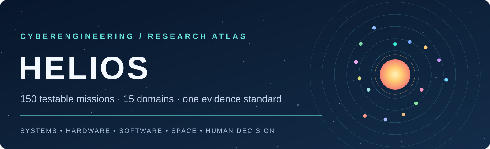
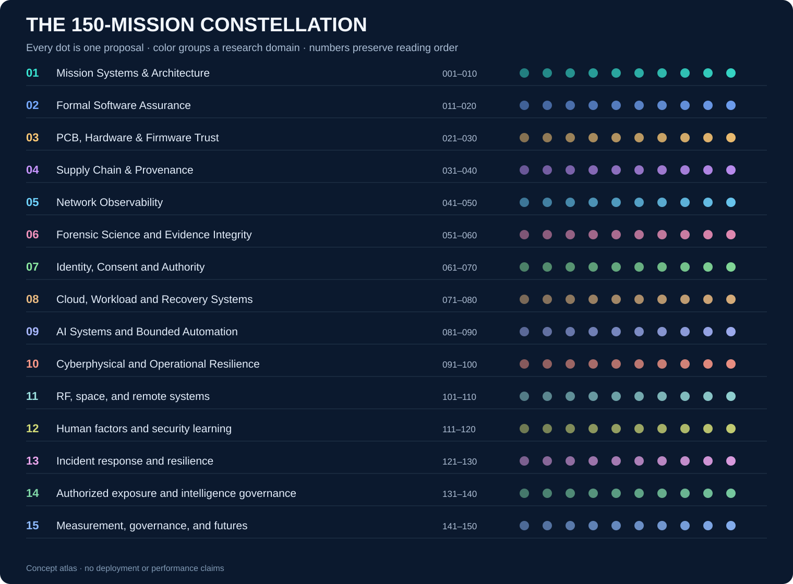
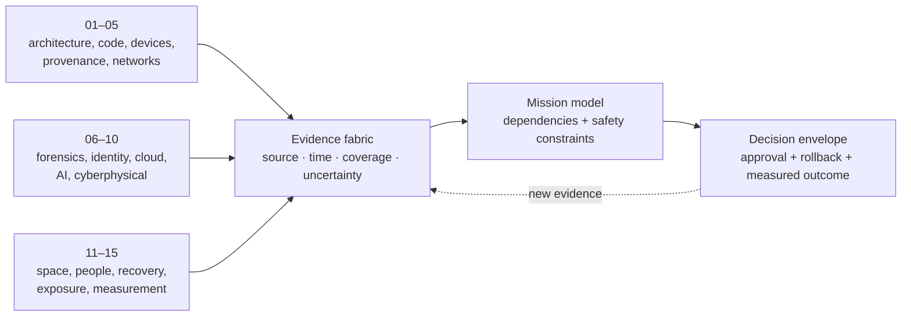

# Project HELIOS · Cyber Mission Atlas

**New to IT or red/blue-team work? Start with [MERCURY Foundations](foundations/README.md): everyday IT, Kali orientation, twenty core tools, manual-page navigation, six local labs and three actual publisher screenshots.** The [Church of Malware public forge review](intelligence/CHURCH-FORGE.md) uses the user-selected Explore listing and a bounded 33-record metadata catalog.

**150 distinct, testable cyberengineering research missions across 15 domains.**

**Graduate research extension: 180 total missions.** All 150 originals are preserved, with 30 new NASA-inspired proposals, 15 domain models, 45 graduate challenges, 11 applicable resource contracts, six executable reference experiments, seven data figures and a pinned CISA metadata snapshot. Start in the [Research Flightbook](research/README.md). These remain proposals and bounded reference mechanics; field effectiveness has not been established. This is a GitHub-native engineering atlas: detailed proposals, models, evaluation criteria, visuals, and primary-source references. It is a research portfolio, not a deployed defense product. Every mission is written for owned, synthetic, or explicitly authorized systems.

| Portfolio | Evidence | Delivery |
| :--- | :--- | :--- |
| **15 domains × 10 missions** in fixed reading order | A mechanism, data plan, falsifier, and guardrail for every idea | Markdown chapters, a machine-readable catalog, diagrams, and validation checks |



## Choose an orbit

The numbers are permanent identifiers. Read straight through for a full survey, or enter at the domain closest to your system. Each chapter combines its own design map with ten individually cited proposals.

Want every title and thesis at once? Open the [complete 150-mission index](INDEX.md); every row links directly to its full proposal.

<!-- ATLAS_INDEX_START -->
| Orbit | Domain | Missions |
| :--- | :--- | :---: |
| 01 | [Mission Systems & Architecture](atlas/01-mission-systems-and-architecture.md) | 001–010 |
| 02 | [Formal Software Assurance](atlas/02-formal-software-assurance.md) | 011–020 |
| 03 | [PCB, Hardware & Firmware Trust](atlas/03-pcb-hardware-and-firmware-trust.md) | 021–030 |
| 04 | [Supply Chain & Provenance](atlas/04-supply-chain-and-provenance.md) | 031–040 |
| 05 | [Network Observability](atlas/05-network-observability.md) | 041–050 |
| 06 | [Forensic Science and Evidence Integrity](atlas/06-forensic-science.md) | 051–060 |
| 07 | [Identity, Consent and Authority](atlas/07-identity-privacy.md) | 061–070 |
| 08 | [Cloud, Workload and Recovery Systems](atlas/08-cloud-systems.md) | 071–080 |
| 09 | [AI Systems and Bounded Automation](atlas/09-ai-security.md) | 081–090 |
| 10 | [Cyberphysical and Operational Resilience](atlas/10-ot-resilience.md) | 091–100 |
| 11 | [RF, space, and remote systems](atlas/11-rf-space-remote-systems.md) | 101–110 |
| 12 | [Human factors and security learning](atlas/12-human-factors-learning.md) | 111–120 |
| 13 | [Incident response and resilience](atlas/13-response-resilience.md) | 121–130 |
| 14 | [Authorized exposure and intelligence governance](atlas/14-authorized-exposure-intelligence.md) | 131–140 |
| 15 | [Measurement, governance, and futures](atlas/15-measurement-governance-futures.md) | 141–150 |
<!-- ATLAS_INDEX_END -->

The [machine-readable catalog](data/ideas.json) carries the same order, titles, summaries, chapter paths, and source URLs. The [research method](editorial/RESEARCH_METHOD.md) defines what evidence would be required to move an idea from concept to field pilot. The [source ledger](SOURCES.md) records official publications and their scopes. The [input boundary](editorial/INPUT_BOUNDARY.md) explains how the supplied local materials were handled without publishing evidence or running programs from them.

## How the missions fit together



The [system architecture](editorial/SYSTEM_ARCHITECTURE.md) develops this into six integrated campaigns: trustworthy devices, evidence-aware analysis, mission-aware networks, privacy-preserving identity, safe remote operations, and measured human judgment. These campaigns suggest combinations of ideas; they do not imply that the systems have been built.

## Ambitious starting points

| If your mission needs… | Start with | First credible result |
| --- | --- | --- |
| A defensible answer to “what fails next?” | **001 Function-First Risk Atlas**, **003 Blast-Radius Digital Twin**, **121 Mission-Weighted Recovery Order** | An owned service dependency model that predicts held-out incident consequences better than an asset-only baseline. |
| A board that visibly carries its trust model | **021 Trust-Visible PCB**, **029 CAD-to-Fab Provenance Chain**, **023 Atomic Firmware Lifeboat** | A bench prototype whose layout review, fabrication lineage, and interrupted-update recovery are all testable. |
| Incident conclusions with honest uncertainty | **051 Memory Snapshot Confidence Map**, **057 Negative-Evidence Logic**, **081 Evidence-Bound Security Assistant** | A synthetic case where analysts can distinguish observed facts from unobservable gaps and unsupported inference. |
| Safer low-power or intermittent operations | **095 Island-Mode Mission Test**, **103 CubeSat Update Survival Model**, **110 Remote Evidence Courier** | An emulator/bench exercise measuring essential-function survival, rollback, and signed evidence delivery under link loss. |
| Privacy that can be engineered and measured | **066 Private Correlation Token**, **070 Data-Minimization Twin**, **144 Counterfactual Defense Study** | An approved data-flow experiment that quantifies utility retained versus identifiable information collected. |
| A way to measure cyber value over years | **141 Cyber Quality Unit**, **145 Capability Maturity Evidence Graph**, **150 Cyber Mission Observatory** | A versioned outcome definition and longitudinal evidence pipeline, with stated limits on causal interpretation. |

## Editorial and safety contract

- **Proposal, not result.** Each mission states what to build and how to disprove it. Citations ground design constraints; they are not evidence of achieved performance.
- **Authority is explicit.** Tests use lab, owned, synthetic, or permissioned environments. RF, OT, spacecraft, and external exposure studies require domain review before active trials.
- **Data stays controlled.** Raw packet captures, memory dumps, logs, executables, OSINT material, and personal records from the source packet are absent from this public repository.
- **Failure matters.** Every evaluation should record false alarms, missing observations, operational cost, privacy impact, and a stop condition as appropriate.

For the editorial scoring standard, see the [quality rubric](editorial/QUALITY_RUBRIC.md). To verify the catalog and regenerated visuals with standard Python:

```text
python scripts/build_atlas.py --check
```

To propose a new mission or strengthen an existing one, follow [CONTRIBUTING.md](CONTRIBUTING.md). The atlas is independent research documentation and does not claim NASA, NIST, CISA, or other agency endorsement.

## Red-team assessment and public intelligence

The [150-module Assessment Flightbook](assessment/README.md) progresses from basic cybersecurity to authorized assessment engineering, adversary-informed detection, mission exercises and graduate research. It connects to the preserved mission dossiers and offline models rather than adding disconnected products. Modules are proposals; they do not add another 150 implemented tools.

The [Public Intelligence desk](intelligence/README.md) documents Nightmare-Eclipse, Church of Malware, two government-described activity clusters and four public homepage bylines through a six-source, eleven-claim ledger. It distinguishes research personas, communities, bylines and intrusion attribution. No real identities or criminal roles are inferred from handles.
