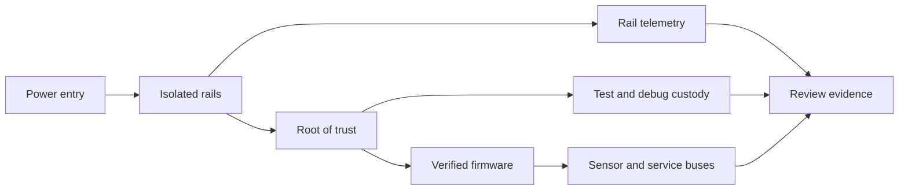

# 03 · PCB, Hardware & Firmware Trust

**Research status:** proposed board and firmware concepts, with verification plans rather than fabricated measurements. A compelling security board should communicate its architecture visually: power islands, trust zones, test points, lifecycle states, and recovery paths should read directly from the schematic and PCB. The same design must still pass electrical, fabrication, firmware, and fault-tolerance review. Prototype experiments use owned boards, development parts, and safe bench limits.

## 021 · Trust-Visible PCB

**Hypothesis.** Board layout encoding power, trust zones, test points, and fault isolation improves design-review accuracy. **Design.** Produce a layered KiCad board whose silkscreen and drawing layers identify trust boundaries, rail names, lifecycle-only debug access, recovery controls, and measurement points; encode the same boundaries in a machine-readable net-to-zone table. **Evidence.** Use an original schematic, BOM, stackup, design-rule report, and rendered assembly views, all from an owned prototype. **Test.** Randomize reviewers between conventional and trust-visible drawings; compare time and accuracy identifying injected isolation, labeling, and testability defects. **Boundary.** Visual clarity is an assurance aid, not electrical proof: DRC, ERC, impedance, creepage, and hardware tests remain mandatory. Sources: [KiCad PCB editor and DRC manual](https://docs.kicad.org/9.0/en/pcbnew/pcbnew.html), [NIST SP 800-160 systems engineering](https://csrc.nist.gov/pubs/sp/800/160/v1/r1/final).

## 022 · Power-Rail Integrity Sentinel

**Hypothesis.** Non-invasive rail telemetry distinguishes component failure from unexpected firmware behavior. **Design.** Place current and voltage monitors on selected rails, timestamp measurements, and infer operating mode from a bounded state model of draw, ripple, and transition sequence. Compare rail signatures with authenticated firmware state without granting the monitor control of the main processor. **Evidence.** Record benign boot, sleep, brownout, and peripheral-fault traces on an owned test board at safe supply limits. **Test.** Measure fault classification accuracy, false alarms per device-day, detection latency, and added milliwatts against a telemetry-free baseline. **Boundary.** Similar power signatures can arise from different causes; the monitor reports anomalies and confidence, never an unsupported malware verdict. Sources: [NIST SP 800-193 firmware resiliency](https://csrc.nist.gov/pubs/sp/800/193/final), [KiCad PCB editor design rules](https://docs.kicad.org/9.0/en/pcbnew/pcbnew.html).

## 023 · Atomic Firmware Lifeboat

**Hypothesis.** A/B update and verified rollback preserve bootability under interrupted updates. **Design.** Specify immutable first-stage verification, two signed application slots, an update journal, anti-rollback state, and a bounded recovery mode. Model boot-state transitions so power loss at any write boundary preserves one authenticated image. **Evidence.** Use a development board, test keys, synthetic firmware images, and a programmable supply that stays within manufacturer specifications. **Test.** Interrupt updates at randomized checkpoints; report successful recovery fraction, worst-case recovery time, and any state that boots an unverified image. **Boundary.** Recovery credentials and rollback exceptions require custody rules; repeated bench success does not establish protection against invasive physical attacks. Sources: [NIST SP 800-193](https://csrc.nist.gov/pubs/sp/800/193/final), [OpenTitan device lifecycle](https://opentitan.org/book/doc/security/specs/device_life_cycle/).

## 024 · Debug-Port Custody Map

**Hypothesis.** Lifecycle-bound debug access reduces accidental field exposure while preserving repairability. **Design.** Map JTAG, UART, SWD, test pads, and firmware service commands to manufacturing, provisioning, field, and return states. Gate each path with a documented authorization condition and log lifecycle transitions in a signed manufacturing record. **Evidence.** Review an owned board's schematic, test fixture, fuse states, and service procedures using synthetic device identities. **Test.** At every lifecycle state, verify that a fixture can perform only its approved operations; count unauthorized-access paths and repair procedures made impossible. **Boundary.** Disabling ports can harm recoverability and accessibility; the architecture must include a controlled repair route before irreversible locking. Sources: [OpenTitan Device Life Cycle](https://opentitan.org/book/doc/security/specs/device_life_cycle/), [NIST SP 800-193](https://csrc.nist.gov/pubs/sp/800/193/final).

## 025 · Key-Custody Microarchitecture

**Hypothesis.** Measuring secret access across boot, operation, and disposal identifies key-leakage windows. **Design.** Create a data-flow graph for key generation, derivation, storage, side-loaded use, backup, rotation, and destruction. Mark each transition by trust domain, permitted requester, memory residence, and observability; prefer hardware-held keys where the use case requires them. **Evidence.** Use test keys and a simulator or development silicon; never inspect or commit live production secrets. **Test.** Seed misrouted key requests and interrupted zeroization, then measure policy violations found and time keys remain readable outside intended domains. **Boundary.** The model cannot establish resistance to physical extraction without specialized evaluation, and unsupported zeroization claims must be excluded. Sources: [Trusted Computing Group TPM 2.0 Library](https://trustedcomputinggroup.org/resource/tpm-library-specification/), [OpenTitan key manager interfaces](https://opentitan.org/book/hw/ip/keymgr/doc/interfaces.html).

## 026 · Side-Channel Budget Ledger

**Hypothesis.** A design-time emissions budget helps compare countermeasures without claiming perfect secrecy. **Design.** Allocate a leakage budget across clocking, cryptographic blocks, power distribution, and enclosure interfaces; identify test conditions, threat capability, and measured signal-to-noise for each path. Compare placement, filtering, masking, and constant-time choices in an owned laboratory prototype. **Evidence.** Collect only traces from authorized hardware with test keys and published acquisition settings. **Test.** Report a predeclared statistical leakage metric, measurement repeatability, performance cost, and uncertainty against a baseline board. **Boundary.** No finite experiment proves absence of side channels; results apply only to stated probes, bandwidth, sample count, and operating conditions. Sources: [OpenTitan secure hardware design guidelines](https://opentitan.org/book/doc/security/implementation_guidelines/hardware/index.html), [OpenTitan AES design documentation](https://opentitan.org/book/hw/ip/aes/doc/theory_of_operation.html).

## 027 · Sensor-Bus Cross-Check

**Hypothesis.** Independent sensor paths detect silent integrity faults with bounded false alarms. **Design.** Pair a primary digital sensor with an independent modality or reference channel, then model consistency as a time-aware residual with uncertainty from calibration, drift, and environmental change. Route cross-check telemetry through a separate diagnostic path where practical. **Evidence.** Use a synthetic plant or owned instrument, documented calibration standards, and controlled benign fault injection. **Test.** Quantify detection probability, false alarms per day, and detection latency for stuck values, bus dropout, and gradual drift. **Boundary.** Common-mode failures can fool both channels; independence assumptions and calibration intervals must be explicit. Sources: [NIST SP 800-160 Vol. 2 Rev. 1](https://csrc.nist.gov/pubs/sp/800/160/v2/r1/final), [NIST SP 800-82 Rev. 3](https://csrc.nist.gov/pubs/sp/800/82/r3/final).

## 028 · Board Fault-Containment Cells

**Hypothesis.** Partitioned power/reset domains limit single-component failure propagation. **Design.** Divide the PCB into protected cells with current limits, reset isolation, monitored crossings, and a documented shared-ground strategy. Simulate fault propagation before layout; keep heat, return current, and timing constraints in the electrical model. **Evidence.** Use an owned board, component datasheets, SPICE where appropriate, and safe current-limited bench faults. **Test.** Measure the number of surviving essential functions and recovery time after each permitted single-cell fault, compared with an unpartitioned reference design. **Boundary.** Isolation can add noise, cost, and common points of failure; passing a single-fault matrix does not cover correlated or destructive events. Sources: [NIST cyber-resilient systems guidance](https://csrc.nist.gov/pubs/sp/800/160/v2/r1/final), [KiCad PCB design-rule documentation](https://docs.kicad.org/9.0/en/pcbnew/pcbnew.html).

## 029 · CAD-to-Fab Provenance Chain

**Hypothesis.** Signed design and manufacturing artifacts make unauthorized board revisions detectable. **Design.** Bind schematic revision, PCB source, stackup, BOM, fabrication outputs, assembly instructions, and inspection records into a signed manifest with canonical hashes. Add an acceptance step that compares delivered files and board markings with the approved build package. **Evidence.** Use a deliberately small, owned reference PCB and synthetic revision swaps; avoid publishing vendor-private manufacturing packages. **Test.** Seed altered Gerbers, substituted BOM entries, and stale drill files; measure detection recall and reviewer effort before fabrication release. **Boundary.** Digital provenance does not by itself prove physical part authenticity; inspection and supplier controls remain necessary. Sources: [NIST manufacturing digital thread](https://www.nist.gov/programs-projects/digital-thread-manufacturing), [NIST IR 8536 supply-chain traceability](https://csrc.nist.gov/pubs/ir/8536/final).

## 030 · Environmental Security Margin

**Hypothesis.** Thermal, voltage, and radiation tests reveal where security controls cease to function reliably. **Design.** Define an operating envelope and monitor verified boot, secure storage, watchdog, and fault reporting across controlled temperature and supply-voltage sweeps; treat radiation as simulation unless suitable authorized facilities exist. **Evidence.** Use owned development boards, manufacturer limits, calibrated instruments, and test keys. **Test.** Plot control pass rate and recovery time against environmental coordinates, with confidence intervals and a clearly stated cutoff for qualification. **Boundary.** Do not exceed component safety ratings or extrapolate laboratory tests to space qualification; any radiation claim needs qualified facilities and separate engineering review. Sources: [NIST SP 800-193 platform firmware resilience](https://csrc.nist.gov/pubs/sp/800/193/final), [NIST SP 800-160 Vol. 1 Rev. 1](https://csrc.nist.gov/pubs/sp/800/160/v1/r1/final).
