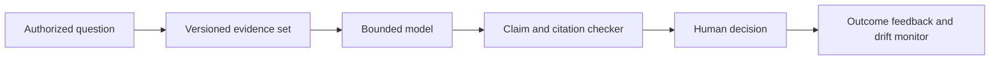

# 09 · AI Systems and Bounded Automation

These projects study how to make security assistance auditable, privacy-aware and subordinate to human authority. The research baseline is a fixed task set, controlled synthetic telemetry and explicit evaluation against unsafe or unsupported conclusions.

| Model obligation | Testable artifact |
|---|---|
| Evidence trace | Every material claim links to a retrieved record or is marked inference |
| Authority boundary | Tool calls checked against scoped permissions before execution |
| Calibration | Confidence compared with observed correctness, including abstentions |
| Privacy | Redaction and leakage probes measured with synthetic canaries |

## 081 · Evidence-Bound Security Assistant

**Thesis.** An assistant is useful only if analysts can distinguish sourced observation from model inference. **System.** Give the model a versioned, access-controlled evidence store; require each claim to cite a record ID and time interval, with unsupported claims labeled as hypotheses. A deterministic checker confirms citation existence and access scope before a report is shown. **Inputs.** Synthetic incident cases and separately authorized, redacted records. **Falsifiable metric.** Supported-claim precision, missing-citation rate and analyst time to verify conclusions compared with a text-only baseline. **Limitation.** An existing citation can still be misinterpreted; human review and evidence replay remain necessary. See [NIST AI RMF](https://www.nist.gov/publications/artificial-intelligence-risk-management-framework-ai-rmf-10) and [NIST incident response](https://csrc.nist.gov/pubs/sp/800/61/r3/final).

## 082 · Prompt Boundary Evaluator

**Thesis.** Security assistants must treat retrieved documents and logs as untrusted task data. **System.** Build an evaluation harness that inserts benignly simulated instruction attempts into synthetic search results, code comments and ticket text; measure whether the assistant preserves its approved task, data limits and tool permissions. Version the test corpus and distinguish answer contamination from unauthorized action. **Inputs.** Synthetic adversarial text and isolated non-production tools; no live target interaction. **Falsifiable metric.** Rate of attempted boundary crossings blocked, legitimate-task completion and false rejections across multiple prompt styles. **Limitation.** A finite corpus cannot prove immunity to new attacks. See [NIST Generative AI Profile](https://www.nist.gov/publications/artificial-intelligence-risk-management-framework-generative-artificial-intelligence) and [CISA secure AI guidance](https://www.cisa.gov/news-events/alerts/2023/11/26/cisa-and-uk-ncsc-unveil-joint-guidelines-secure-ai-system-development).

## 083 · Model Lineage Registry

**Thesis.** A model result needs a reproducible route back to data, code and evaluation. **System.** Link model version, training-data manifest, approved use, preprocessing, hyperparameters, evaluation suite, deployment target and signer in a provenance graph. Record dataset licenses and deletion requirements without storing sensitive data in the registry. **Inputs.** Open or synthetic datasets and authorized model metadata. **Falsifiable metric.** Percentage of sampled predictions reproducible from a pinned model and input digest, and detection of planted lineage breaks. **Limitation.** Reproducibility and provenance do not establish safety or fairness in use. See [NIST AI RMF](https://www.nist.gov/publications/artificial-intelligence-risk-management-framework-ai-rmf-10) and [SLSA provenance](https://slsa.dev/spec/v1.2/).

## 084 · Privacy Leakage Observatory

**Thesis.** Model privacy risk should be measured over updates and usage patterns, not once at release. **System.** Place synthetic canary records in controlled training and retrieval sets, then run membership, memorization and prompt-leakage probes under an approved evaluation plan. Track exposed canary frequency and contextual leakage by model version, with a kill switch for unsafe deployments. **Inputs.** Synthetic sensitive-looking records only unless explicit lawful data authorization exists. **Falsifiable metric.** Canary extraction rate, membership-advantage estimate and false positives, reported with confidence intervals. **Limitation.** Canary tests sample only a subset of possible leakage paths; differential privacy requires separate formal accounting. See [NIST AI 600-1](https://www.nist.gov/publications/artificial-intelligence-risk-management-framework-generative-artificial-intelligence) and [NIST SP 800-226](https://csrc.nist.gov/pubs/sp/800/226/final).

## 085 · Agent Authority Envelope

**Thesis.** An AI agent should have exactly the tool scope, budget and lifetime needed for a stated task. **System.** Express authority as an envelope `(tools, resources, actions, time, budget, approver)` enforced by a policy gateway outside the model. Generate a complete decision log and a dry-run mode; require renewed authorization if the task expands. **Inputs.** Synthetic workflow tasks and mocked tools before any production integration. **Falsifiable metric.** Zero successful out-of-envelope calls in a test corpus, with task completion and policy-decision latency recorded. **Limitation.** A permitted action can still be harmful if the task or resource classification is wrong. See [NIST SP 800-207](https://csrc.nist.gov/pubs/sp/800/207/final) and [NIST Generative AI Profile](https://www.nist.gov/publications/artificial-intelligence-risk-management-framework-generative-artificial-intelligence).

## 086 · Calibrated Alert Triage

**Thesis.** An alert rank is valuable only if predicted urgency matches observed outcomes and analyst capacity. **System.** Combine confirmed exploitation, asset criticality, reachable attack path, detection quality and uncertainty into a ranking model. Preserve separate factors and allow abstention on poor evidence; display the impact of each factor. **Inputs.** Timestamped public KEV snapshots, synthetic assets and approved historical alert labels. **Falsifiable metric.** Precision among the top `k` cases, time to true-positive review and calibration error across time splits; compare with a KEV-only baseline. **Limitation.** Historical response labels can encode organizational bias or missed incidents. See [CISA KEV](https://www.cisa.gov/known-exploited-vulnerabilities-catalog) and [NIST AI RMF](https://www.nist.gov/publications/artificial-intelligence-risk-management-framework-ai-rmf-10).

## 087 · Human Override Feedback Loop

**Thesis.** Overrides reveal both model errors and changing operational needs. **System.** Capture an analyst’s override with reason, evidence references, final outcome and whether the model’s original decision was uncertain. Separate safety-critical overrides from preference changes and use reviewed labels for periodic evaluation, not immediate self-training. **Inputs.** Synthetic triage exercises and consented analyst feedback metadata. **Falsifiable metric.** Reduction in repeat override errors on held-out cases without increased false negatives or analyst burden. **Limitation.** Reviewers can disagree, and an override is not automatically ground truth. See [NIST AI RMF](https://www.nist.gov/publications/artificial-intelligence-risk-management-framework-ai-rmf-10) and [NIST SP 800-61 Rev. 3](https://csrc.nist.gov/pubs/sp/800/61/r3/final).

## 088 · Concept-Drift Sentinel

**Thesis.** A detection model can become unreliable while its infrastructure remains healthy. **System.** Monitor changes in input schema, feature distribution, alert prevalence, analyst outcomes and subgroup error. Use a reference-window model with defined false-alarm budget and trigger a controlled reevaluation, rollback or human-only fallback when confidence degrades. **Inputs.** Synthetic time-series shifts and approved, minimized production aggregates. **Falsifiable metric.** Detection delay for planted drift and false alarms per month, plus performance retained after mitigation. **Limitation.** Distribution change does not always imply loss of security performance; outcome labels may arrive late. See [NIST AI RMF](https://www.nist.gov/publications/artificial-intelligence-risk-management-framework-ai-rmf-10) and [CISA secure AI guidance](https://www.cisa.gov/news-events/alerts/2023/11/26/cisa-and-uk-ncsc-unveil-joint-guidelines-secure-ai-system-development).

## 089 · Synthetic Telemetry Fidelity Lab

**Thesis.** Synthetic incident data should disclose what behavior it represents and where it diverges from real operations. **System.** Generate host, network and identity events from an explicit state-machine scenario; validate causal order, protocol syntax, class balance and missingness. Compare aggregate statistics with authorized, privacy-minimized reference summaries, never copy individual records. **Inputs.** Model-generated events and aggregate reference distributions. **Falsifiable metric.** Utility of detectors trained on synthetic data when tested on held-out authorized data, plus privacy-leakage and realism-gap measures. **Limitation.** High visual realism is no evidence of operational fidelity; overfitting to one scenario is likely. See [NIST AI RMF](https://www.nist.gov/publications/artificial-intelligence-risk-management-framework-ai-rmf-10) and [NIST Privacy Framework](https://www.nist.gov/privacy-framework).

## 090 · AI Exercise Safety Case

**Thesis.** An AI-driven security exercise needs a documented argument that its benefits justify its operational risks. **System.** Define exercise goals, permitted targets, simulated capabilities, data boundaries, stop conditions and independent observers. Link each hazard to a control and a test result in a safety-case graph; require a human release decision before a live drill. **Inputs.** Sandboxed systems and synthetic incidents; no unapproved scanning or action against third-party assets. **Falsifiable metric.** Coverage of identified hazards, response time to planted stop conditions and observed disruption against a predeclared limit. **Limitation.** Passing a sandbox trial does not guarantee the same outcome in production. See [NIST AI 600-1](https://www.nist.gov/publications/artificial-intelligence-risk-management-framework-generative-artificial-intelligence) and [NIST SP 800-61 Rev. 3](https://csrc.nist.gov/pubs/sp/800/61/r3/final).
