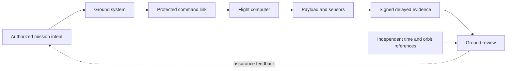

# 11 · RF, space, and remote systems

**Research status:** proposed architectures and falsifiable experiments. No flight telemetry, command authority, spectrum measurements, or mission results have been acquired for this atlas. All tests below assume an owned bench, emulator, or explicitly authorized mission environment.

Space cybersecurity is an end-to-end systems problem: the command origin, ground software, radio link, spacecraft, payload, and delayed evidence path all affect mission assurance. NASA's [Space System Protection Standard](https://standards.nasa.gov/standard/nasa/nasa-std-1006) supplies a protection baseline; NASA's [ground-data-systems survey](https://www.nasa.gov/smallsat-institute/sst-soa/ground-data-systems-and-mission-operations/) describes the interconnected mission elements. The ten concepts below deliberately separate authority, integrity, availability, timing, and evidence preservation.

| Research band | Ideas | Primary outcome |
|---|---|---|
| Command and configuration authority | 101, 104, 107 | Verifiable control boundaries |
| Link, timing, and orbit integrity | 102, 105, 106, 108 | Lower ambiguity under degraded communications |
| Update and fault survival | 103, 109 | Recoverability after controlled faults |
| Delayed evidence | 110 | Traceable mission record |

## 101 · Ground-to-Orbit Command Chain

**Thesis.** A command is trustworthy only when the approving role, ground transformation, transmission, receipt, and on-board action can be joined into one verifiable record. **Proposed system.** Define a command-event schema with mission identifier, approved intent hash, signer, ground software revision, sequence number, transmission window, spacecraft receipt, and execution state. A graph checker rejects missing or inconsistent links; it never generates flight commands. **Evidence and test.** Use a simulated mission with injected lost, duplicated, delayed, and reordered records. Compare the fraction of actions with complete provenance and the time to explain a disputed action against ordinary log review. **Boundary.** Signatures cannot prove that the original operator made a wise choice; the model must also account for compromised endpoints and clock uncertainty. Anchors: [NASA-STD-1006A](https://standards.nasa.gov/standard/nasa/nasa-std-1006), [NASA ground systems](https://www.nasa.gov/smallsat-institute/sst-soa/ground-data-systems-and-mission-operations/).

## 102 · Link-Integrity Weather Map

**Thesis.** Treating all RF degradation as a security event wastes attention; treating all degradation as weather hides integrity loss. **Proposed system.** Build a passive observation model with received-signal quality, error-correction counts, expected geometry, authorized link schedule, antenna state, and receiver health. It produces a calibrated probability of environmental, equipment, or unresolved causes, with abstention when evidence is weak. **Evidence and test.** Replay labeled, synthetic benign fade and equipment-fault traces through a receiver emulator. Score calibration, false-alarm rate at fixed detection sensitivity, and detection delay. Preserve raw uncertainty rather than assigning an attacker. **Boundary.** No transmit experiments, interference generation, or analysis of third-party links; propagation conditions may be nonstationary. Anchors: [NASA ground systems](https://www.nasa.gov/smallsat-institute/sst-soa/ground-data-systems-and-mission-operations/), [NIST cyber-resilient systems](https://csrc.nist.gov/pubs/sp/800/160/v2/r1/final).

## 103 · CubeSat Update Survival Model

**Thesis.** A verified A/B firmware architecture should preserve a bootable, authorized image across interrupted remote updates. **Proposed system.** Model boot states, image hashes, signature decisions, watchdog resets, energy reserve, and contact windows as a state machine. A hardware-in-the-loop or software emulator interrupts updates at every transition and records whether the device boots a known image without unsafe command acceptance. **Evidence and test.** Measure recovery success and time, version monotonicity, and the proportion of transitions with an unambiguous audit trail. Compare against a single-image baseline using identical interruption schedules. **Boundary.** Tests stay on a bench or simulator; flight integration would require separate mission review, memory-wear analysis, and platform-specific fault injection. Anchors: [NASA-STD-1006A](https://standards.nasa.gov/standard/nasa/nasa-std-1006), [NIST SP 800-160 Vol. 2](https://csrc.nist.gov/pubs/sp/800/160/v2/r1/final).

## 104 · Ground-Station Configuration Witness

**Thesis.** A cryptographically linked history of approved ground-station configurations can make unnoticed operational drift easier to detect. **Proposed system.** Each approved configuration snapshot records software versions, antenna-controller settings, command-routing policy, signer, maintenance ticket, and effective interval. A read-only witness compares live inventory with the approved snapshot and produces a human-reviewable diff. **Evidence and test.** In a station emulator, introduce authorized maintenance changes and accidental deviations; measure detection precision, median review time, and missed critical differences. The output is evidence for operators, not an automatic command to equipment. **Boundary.** The witness itself needs independent time, protected keys, and a way to represent emergency changes without retroactive falsification. Anchors: [NASA ground systems](https://www.nasa.gov/smallsat-institute/sst-soa/ground-data-systems-and-mission-operations/), [NIST CSF 2.0](https://www.nist.gov/publications/nist-cybersecurity-framework-csf-20).

## 105 · Ephemeris Data Integrity Check

**Thesis.** Cross-checking orbital-state inputs from independent approved sources can reveal corrupted or stale data before planning uses them. **Proposed system.** Accept signed ephemeris records, source identity, epoch, reference frame, uncertainty covariance, and approved validity window. Normalize frames, propagate the state to a common epoch, and compare residuals against combined uncertainty. **Evidence and test.** Use public mission-independent orbit examples or synthetic trajectories with controlled timestamp, frame, and value defects; measure defect recall at a predeclared false-alert budget and sensitivity to covariance assumptions. **Boundary.** Agreement between correlated sources is not independent confirmation, and the checker must abstain when data are stale; it does not produce maneuver recommendations. Anchors: [NASA-STD-1006A](https://standards.nasa.gov/standard/nasa/nasa-std-1006), [NIST SP 800-160 Vol. 1](https://www.nist.gov/publications/engineering-trustworthy-secure-systems).

## 106 · Time-Source Trust Ensemble

**Thesis.** Independent clock evidence can distinguish timing uncertainty from event-order disagreement in remote operations. **Proposed system.** Combine local oscillator telemetry, authenticated time-service status, contact timing, and approved reference clocks into an interval estimate rather than one asserted timestamp. The event store records source, offset estimate, drift, and confidence interval for every time correction. **Evidence and test.** In simulation, introduce controlled drift, outages, and delayed packets. Compare event-order accuracy, false conflict rate, and interval coverage with a single-clock baseline. **Boundary.** Shared upstream clocks can create correlated failure; the study must inventory common dependencies and avoid treating a narrow interval as proof of integrity. Anchors: [NASA ground systems](https://www.nasa.gov/smallsat-institute/sst-soa/ground-data-systems-and-mission-operations/), [NIST SP 800-160 Vol. 2](https://csrc.nist.gov/pubs/sp/800/160/v2/r1/final).

## 107 · Payload Partition Boundary

**Thesis.** Measured resource and authority isolation should prevent a noncritical experiment from degrading spacecraft command functions. **Proposed system.** Specify a partition contract for CPU, memory, bus access, power draw, persistent storage, command privileges, and reset behavior. A bench emulator records actual resource use and policy decisions while benign workloads reach their approved limits. **Evidence and test.** Measure command-path latency and availability under payload saturation, policy violation count, and recovery time after a payload reset. Compare measured margins with a predeclared isolation budget. **Boundary.** A software partition cannot compensate for shared power or thermal faults; those paths require explicit hardware analysis and mission-specific qualification. Anchors: [NASA-STD-1006A](https://standards.nasa.gov/standard/nasa/nasa-std-1006), [NIST SP 800-160 Vol. 1](https://www.nist.gov/publications/engineering-trustworthy-secure-systems).

## 108 · Spectrum-Coexistence Ledger

**Thesis.** A documented, authorized history of passive RF observations and operating schedules can improve reliability planning for shared spectrum. **Proposed system.** Record mission-owned receiver measurements, location, time, frequency allocation, antenna configuration, expected contact, and instrument calibration, then map recurring coexistence conditions with uncertainty bands. **Evidence and test.** Compare contact-quality forecasts against held-out authorized observations; report false predicted outages and missed degradation windows. The artifact should support planning and coordination with spectrum managers. **Boundary.** The project does not transmit, jam, geolocate third parties, or infer intent from an unknown signal. Regulatory and mission approvals define collection scope; receiver artifacts may mimic external emissions. Anchors: [NASA ground systems](https://www.nasa.gov/smallsat-institute/sst-soa/ground-data-systems-and-mission-operations/), [NIST SP 800-160 Vol. 2](https://csrc.nist.gov/pubs/sp/800/160/v2/r1/final).

## 109 · Radiation–Security Coupling Study

**Thesis.** Transient hardware faults can alter security state, so resilience claims should include controlled fault conditions as well as normal execution. **Proposed system.** Use a nonflight emulator or approved laboratory board to perturb memory, voltage, and reset events within safe limits. Record boot measurement, key state, authentication decision, watchdog behavior, and recovery state, then construct a transition coverage map. **Evidence and test.** Score fail-closed behavior, recovery probability, and mission availability across a documented fault matrix; separate simulated faults from measured laboratory data. **Boundary.** Generalizing from a laboratory board to radiation flight conditions requires device-specific physics and qualification. No live spacecraft or external equipment is affected. Anchors: [NASA-STD-1006A](https://standards.nasa.gov/standard/nasa/nasa-std-1006), [NIST cyber-resilient systems](https://csrc.nist.gov/pubs/sp/800/160/v2/r1/final).

## 110 · Remote Evidence Courier

**Thesis.** Delay-tolerant, signed evidence bundles can preserve a traceable record when links are intermittent and packets arrive out of order. **Proposed system.** Package telemetry chunks with content hash, source key, sequence window, local-time interval, previous-bundle hash, compression metadata, and retention policy. Ground software verifies integrity, detects gaps, and retains raw bundles alongside parsed views. **Evidence and test.** Replay synthetic losses, duplicates, reordering, and long disconnects; measure recovery completeness, gap detection, storage cost, and reviewer time. **Boundary.** A valid signature proves bundle lineage, not sensor truth. The system must reveal irrecoverable gaps and key compromise assumptions rather than fill them with invented observations. Anchors: [NASA ground systems](https://www.nasa.gov/smallsat-institute/sst-soa/ground-data-systems-and-mission-operations/), [NIST SP 800-61 Rev. 3](https://csrc.nist.gov/pubs/sp/800/61/r3/final).
