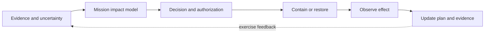

# 13 · Incident response and resilience

**Research status:** proposed models and controlled exercises. The chapter makes no claim that any response plan, backup, or organization has been validated. Ground truth for tests should be explicitly synthetic or obtained from an authorized exercise.

The response design follows [NIST SP 800-61 Rev. 3](https://csrc.nist.gov/pubs/sp/800/61/r3/final), the current incident-response guidance, and [NIST SP 800-160 Vol. 2](https://csrc.nist.gov/pubs/sp/800/160/v2/r1/final) for cyber resilience. Each idea makes a different engineering decision measurable: restoration order, backup quality, intervention reversibility, escalation, quorum, degraded service, delay, communications, learning, or false-alarm cost.

| Response phase | Ideas | What is tested |
|---|---|---|
| Restore and constrain | 121–126 | Mission availability and collateral effects |
| Detect, coordinate, and learn | 127–130 | Delay, evidence, and decision quality |

## 121 · Mission-Weighted Recovery Order

**Thesis.** Restoring services in dependency and mission-value order should recover useful capability sooner than restoring the most visible servers first. **Proposed system.** Build a directed dependency graph with service readiness, prerequisite restoration time, expected mission utility, and uncertainty. An optimizer produces a candidate sequence and explains tradeoffs; operators approve every action. **Evidence and test.** In a synthetic outage simulator, compare time-integrated mission utility, total restore time, and number of blocked steps against alphabetical and asset-priority baselines. Perturb dependencies to test robustness. **Boundary.** Criticality weights must come from mission owners and may change during an incident; a graph with missing dependencies can produce unsafe priorities. Anchors: [NIST SP 800-61 Rev. 3](https://csrc.nist.gov/pubs/sp/800/61/r3/final), [NIST SP 800-34 Rev. 1](https://csrc.nist.gov/pubs/sp/800/34/r1/upd1/final).

## 122 · Verified Restore Gate

**Thesis.** A backup is operationally valuable only if its data, configuration, dependencies, and restored function can be independently verified. **Proposed system.** Attach to each backup a manifest of content hashes, application version, secret references, restoration prerequisites, and read-only validation tests. Restore into an isolated environment and record both integrity and service checks before promotion. **Evidence and test.** Use synthetic corruption, missing-dependency, and version-skew cases. Compare detected defects, time to usable service, and false pass rate against a simple “backup job succeeded” status. **Boundary.** Isolation is required to avoid affecting production, and test data must not expose sensitive records. A successful lab restore is not a guarantee of performance at full scale. Anchors: [NIST SP 800-34 Rev. 1](https://csrc.nist.gov/pubs/sp/800/34/r1/upd1/final), [NIST SP 800-61 Rev. 3](https://csrc.nist.gov/pubs/sp/800/61/r3/final).

## 123 · Reversible Containment Planner

**Thesis.** Comparing the reversibility and mission cost of defensive interventions should reduce unnecessary service disruption. **Proposed system.** Represent each approved containment option with expected risk reduction, affected dependencies, execution delay, monitoring evidence, rollback prerequisites, and worst-case business impact. Show a Pareto set rather than a single automatic recommendation. **Evidence and test.** In fictional incident exercises, compare chosen actions, unintended outage time, rollback success, and response delay with a conventional unstructured playbook. Require human authorization for every containment step. **Boundary.** Estimates are uncertain in a live crisis, and reversibility is not a reason to delay urgent safety actions. The planner remains advisory and has no direct network-control privileges. Anchors: [NIST SP 800-61 Rev. 3](https://csrc.nist.gov/pubs/sp/800/61/r3/final), [NIST SP 800-160 Vol. 2](https://csrc.nist.gov/pubs/sp/800/160/v2/r1/final).

## 124 · Incident Branching Playbook

**Thesis.** A playbook that states evidence thresholds and uncertainty explicitly should produce more consistent escalation than a linear checklist. **Proposed system.** Define a decision graph with observation, confidence, required authority, time limit, privacy constraint, and reversible next steps at each branch. Every branch records why it was taken and which evidence was missing. **Evidence and test.** Present the same synthetic case to different teams using either the branching playbook or current procedure; compare inter-team decision agreement, time to justified escalation, and unnecessary actions. **Boundary.** A graph cannot enumerate every incident; operators need a safe “none of the above” path and a route to an incident commander. Anchors: [NIST SP 800-61 Rev. 3](https://csrc.nist.gov/pubs/sp/800/61/r3/final), [NIST CSF 2.0](https://www.nist.gov/publications/nist-cybersecurity-framework-csf-20).

## 125 · Distributed Recovery Quorum

**Thesis.** Independent approval and evidence checks for high-impact recovery steps should prevent one mistaken actor from propagating a bad state across a system. **Proposed system.** Specify which operations require two roles, distinct devices, validated backup provenance, and an expiry window. Model quorum availability during outages and include a documented emergency exception with retrospective audit. **Evidence and test.** In a sandbox, measure unauthorized promotion rate, legitimate recovery delay, and exception frequency under simulated staff/device unavailability. **Boundary.** Quorum rules can themselves become a single point of failure if all approvers depend on one identity system; the design must test this common-mode risk. Anchors: [NIST SP 800-160 Vol. 2](https://csrc.nist.gov/pubs/sp/800/160/v2/r1/final), [NIST SP 800-34 Rev. 1](https://csrc.nist.gov/pubs/sp/800/34/r1/upd1/final).

## 126 · Safe Degradation Controller

**Thesis.** Preapproved operating limits can keep essential services available when integrity is uncertain, instead of forcing an all-or-nothing shutdown. **Proposed system.** Define service modes, allowed operations, dependency requirements, data freshness, human approvals, and transition guards. Use a simulator to determine whether the controller can enter a reduced mode and return to normal without violating safety invariants. **Evidence and test.** Score essential-service uptime, unsafe transition count, operator workload, and recovery time across controlled failures. **Boundary.** Mode policies must be tailored with safety and mission owners; automation must never override a physical safety interlock or silently accept unverified data. Anchors: [NIST SP 800-160 Vol. 2](https://csrc.nist.gov/pubs/sp/800/160/v2/r1/final), [NIST SP 800-61 Rev. 3](https://csrc.nist.gov/pubs/sp/800/61/r3/final).

## 127 · Compromise Dwell-Time Lens

**Thesis.** Separating time to observe, triage, validate, decide, and contain reveals the dominant response bottleneck more clearly than one mean detection time. **Proposed system.** A timestamped event model stores source, uncertainty interval, analyst decision, handoff, and disposition for each phase. Aggregate distributions by incident class without identifying individuals. **Evidence and test.** Use authorized historical records only with approval, or a synthetic exercise. Calculate median and tail delay per phase, missing-timestamp rate, and improvement after one workflow change. **Boundary.** Real compromise onset is often unknown; reported dwell time must include censoring and uncertainty, not imply exact detection capability. Anchors: [NIST SP 800-61 Rev. 3](https://csrc.nist.gov/pubs/sp/800/61/r3/final), [NIST SP 800-55 Vol. 1](https://csrc.nist.gov/pubs/sp/800/55/v1/final).

## 128 · Outage Communications Continuity

**Thesis.** A deliberately independent coordination channel should shorten recovery delays when primary collaboration tools are unavailable. **Proposed system.** Define a minimal message schema for mission state, decision authority, evidence pointer, next action, and acknowledgement. Exercise multiple approved channels with preloaded contacts and integrity checks; avoid dependence on the same identity, power, or network path. **Evidence and test.** In a tabletop outage, measure time to establish a common operating picture, missed acknowledgements, contradictory instructions, and privacy mistakes. **Boundary.** Backup channels may have reduced confidentiality and auditability; classify allowable content, retention, and legal obligations before any real use. Anchors: [NIST SP 800-34 Rev. 1](https://csrc.nist.gov/pubs/sp/800/34/r1/upd1/final), [NIST SP 800-61 Rev. 3](https://csrc.nist.gov/pubs/sp/800/61/r3/final).

## 129 · Action-to-Outcome Ledger

**Thesis.** Explicitly linking an incident response action to its expected and observed effects improves after-action learning. **Proposed system.** Store an action identifier, approving role, rationale, predicted effect, dependency assumptions, time window, actual observations, and alternative explanations. A timeline view shows where expected results did not occur. **Evidence and test.** Analyze fictional exercise logs with and without the ledger; measure how many causal claims can be traced to observations and how many corrective actions are specific and testable. **Boundary.** Temporal sequence does not establish causation; investigators must note confounders and avoid using the ledger to assign individual blame. Anchors: [NIST SP 800-61 Rev. 3](https://csrc.nist.gov/pubs/sp/800/61/r3/final), [NIST SP 800-55 Vol. 2](https://csrc.nist.gov/pubs/sp/800/55/v2/final).

## 130 · False-Alarm Cost Model

**Thesis.** Response thresholds should account for the harm of unnecessary containment as well as the harm of missed incidents. **Proposed system.** Define a transparent decision model with event probability, mission impact, action efficacy, rollback cost, and uncertainty intervals. Explore thresholds under different mission states and report a range of plausible outcomes rather than a single number. **Evidence and test.** In synthetic exercises, compare total mission loss, false containment hours, missed high-impact events, and sensitivity to uncertain priors against a fixed severity threshold. **Boundary.** Cost weights are governance choices, not facts; the model must never automate dangerous intervention or conceal assumptions from responders. Anchors: [NIST SP 800-55 Vol. 1](https://csrc.nist.gov/pubs/sp/800/55/v1/final), [NIST SP 800-61 Rev. 3](https://csrc.nist.gov/pubs/sp/800/61/r3/final).
