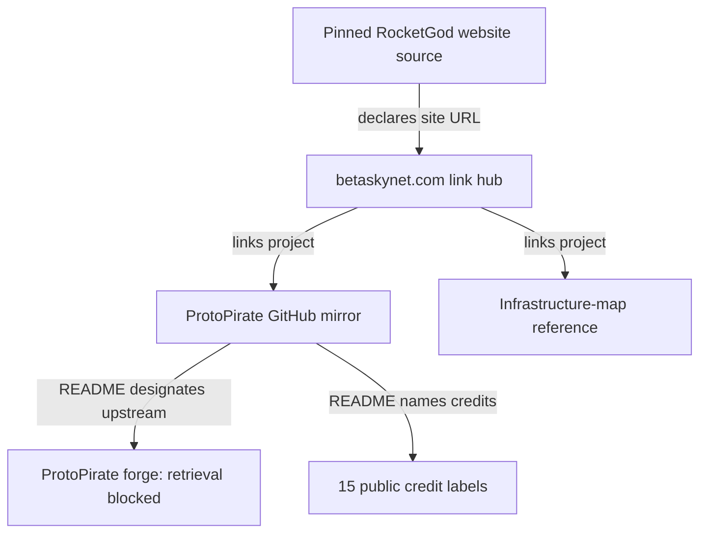

# ORION · Community and Source Directory

Public project references for the HELIOS learning track. Review date: **2026-10-03**. The directory records publisher links, pinned source files and named public credits. Its ten resources are **REFERENCE ONLY**.

[ProtoPirate public credits](PROTOPIRATE.md) · [RocketGod website review](ROCKETGOD.md) · [Infrastructure-map source review](MAP-SOURCE-REVIEW.md) · [Source receipts](SOURCES.md) · [Beginner guide](../foundations/README.md) · [Delivery status](../DELIVERY_STATUS.md)

## Useful public references

| Resource | Engineering relevance | Inspection state |
|---|---|---|
| [DEF CON Groups map](https://dcgroups.betaskynet.com/) | Public community-directory UX | interface reviewed; not a member-location feed |
| [WebSerial CLI](https://webserial.betaskynet.com/) | Browser-to-owned-device permission design | publisher link only; direct retrieval blocked |
| [WebUSB CLI](https://webusb.betaskynet.com/) | Browser device selection and authority | publisher link only; direct retrieval blocked |
| [NASA Earth Map](https://nasa.betaskynet.com/) | Earth-data source attribution and time semantics | publisher link only; direct retrieval blocked; no NASA endorsement established |
| [Mobile Sensor Tester](https://sensorsynth.com/sensor-suite.php) | Local sensor observation and uncertainty | publisher link only; direct retrieval blocked |
| [Domain Checker](https://domainchecker.betaskynet.com/) | Naming and response interpretation | publisher link only; no domain query submitted |
| [DMARC Report Analyzer](https://fuckyou.gay/dmarc.php) | Email-report privacy and parsing design | publisher link only; no report uploaded |
| [Gangstalker Map](https://gangstalkermap.com/) | Infrastructure-layer provenance and coverage | indexed publisher text reviewed; live behavior not verified |
| [ProtoPirate GitHub mirror](https://github.com/RocketGod-git/ProtoPirate) | RF vocabulary and release provenance | README/license reviewed; no build, captures or radio actions |
| [ProtoPirate upstream forge](https://protopirate.net/ProtoPirate/ProtoPirate) | Canonical source versus mirror comparison | publisher-designated upstream; direct retrieval blocked |

## Documented source relationships

Edges represent documented links or README statements. They do not establish personal friendship, legal identity, organization membership or intrusion attribution. A linked project can have different ownership, licensing and availability from its link hub.

## Use the references to learn

Read the [RF and map primer](../foundations/RF-AND-MAPS.md) to distinguish a signal measurement, a decoded interpretation and an infrastructure record. Review local-device authority, source time and coverage before importing any external data. No device connection, location query, radio action, Discord message or upstream project execution was performed for this directory.
