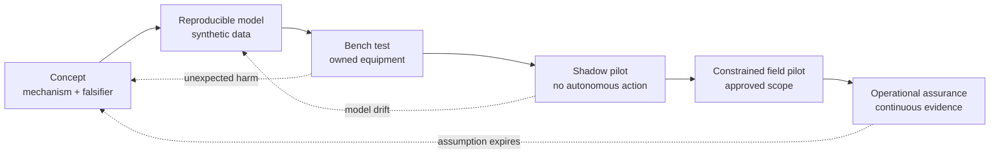

# Research method · from idea to evidence

**Project HELIOS** is a portfolio of 150 proposed cyberengineering research missions. Every entry is a design hypothesis. A cited standard establishes vocabulary or an engineering constraint; it does **not** establish that a proposed system works. No benchmark score, field result, or deployment readiness is claimed in this repository.

## The common experiment card

| Field | Required meaning |
| --- | --- |
| Mission outcome | The service, safety property, privacy right, or decision the project protects. |
| Mechanism | The proposed artifact, model, interface, or control; specific enough to prototype. |
| Counterfactual | A named baseline, such as current practice or the same system without the intervention. |
| Evidence | Authorized, reproducible data with source, time window, collection method, and limits. |
| Endpoint | A measurable result, adverse outcome, and acceptable operating envelope. |
| Uncertainty | Sampling error, missing coverage, model uncertainty, and plausible confounders. |
| Stop condition | A safety, privacy, operational, or legal threshold that ends the experiment. |

For an endpoint $Y$, report the estimated difference between intervention $I$ and baseline $B$, its uncertainty interval, and the population to which the estimate applies:

$$
\Delta_Y = \mathbb{E}[Y\mid I,C] - \mathbb{E}[Y\mid B,C].
$$

$C$ records relevant conditions such as workload, device class, topology, and operator experience. An observational difference is **not** a causal effect by itself. When randomization is unsafe or impossible, document the matching strategy, sensitivity analysis, and competing explanations. Prefer mission outcomes (essential-service availability, recovery time, decision error, privacy exposure) alongside technical proxies (alerts, vulnerabilities, classification accuracy).

## Evidence ladder

Moving up the ladder requires recorded evidence, not an attractive demo. A simulation must state which real-world behaviors it omits. A shadow pilot logs recommendations without applying them. A field pilot requires a named owner, rollback path, retention limit, and stop condition. Systems involving radio, spacecraft, industrial processes, medical data, or public-facing services need domain-specific review before any active test.

## Data and claim discipline

1. **Label origin.** Tag every dataset as synthetic, public benchmark, owned operational, or third-party permissioned. Record licenses and access limits. Never put secrets, raw captures, memory images, or personal records in this public repository.
2. **Version the measurement.** Record instrumentation, clock synchronization, preprocessing, exclusions, model/build version, and the exact endpoint definition. Preserve hashes and lineage for derived evidence.
3. **Test the adverse case.** Evaluate missed events, false positives, downtime, resource cost, accessibility, privacy leakage, distribution shift, and recovery from a bad recommendation.
4. **Separate proposal from result.** Use *proposes*, *would test*, and *may* for concepts. Reserve *improves*, *detects*, and numerical performance claims for measured results with a cited dataset and protocol.
5. **Retire failed hypotheses.** Publish null results and boundary conditions. A failed mechanism with a reproducible test is valuable engineering knowledge.

## Evaluation set

An eventual experiment should report the following, where relevant, with denominator and observation window:

| Dimension | Example measure | Failure hidden by a single score |
| --- | --- | --- |
| Detection | Recall at a fixed false-alert rate | A high recall number obtained by overwhelming analysts. |
| Mission impact | Essential-service minutes lost per scenario | An accurate detector that interrupts critical service. |
| Recovery | Time to verified functional restoration | A backup that restores bytes but not a working service. |
| Assurance | Fraction of security claims with current evidence | A complete checklist backed by expired evidence. |
| Privacy | Identifiable fields collected and retention duration | Better telemetry gained by unnecessary surveillance. |
| Human factors | Correct decisions per time/effort under load | Faster clicks with more consequential mistakes. |
| Resource cost | Compute, energy, storage, and maintenance per useful outcome | A technically effective control that cannot run in the field. |

The source ledger in [SOURCES.md](../SOURCES.md) provides current primary references. The [quality rubric](QUALITY_RUBRIC.md) is an editorial screen, not a performance certification.
