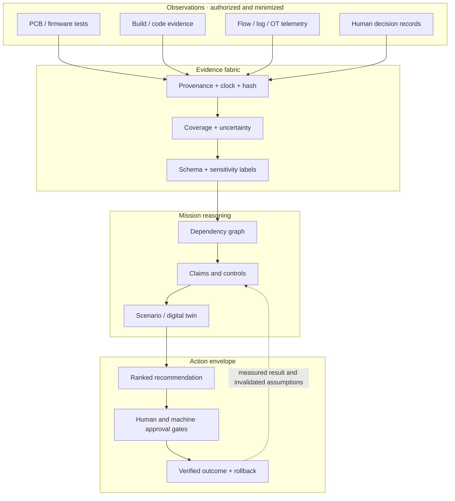

# System architecture · a cyber mission observatory

The 150 missions are intentionally distinct, but they can share an assurance substrate. The unifying engineering object is a **versioned claim with traceable evidence and a mission consequence**. That makes a hardware test, a software build attestation, a cloud permission change, and an incident observation comparable without pretending they have identical physics.

## Minimal evidence contract

An implementation can exchange evidence with a small envelope. Required fields are `evidence_id`, `source_id`, `observation_time`, `ingest_time`, `subject`, `claim`, `method`, `sensitivity`, `integrity_reference`, `coverage`, and `uncertainty`. The value of `coverage` is a description of what the sensor or assessment **could** observe; its absence must not be silently converted into a negative finding. `integrity_reference` can be a content digest or signed record, but a hash alone does not establish trustworthy collection.

The claim graph relates evidence to hypotheses using explicit edges such as *supports*, *contradicts*, *depends on*, and *expired*. Each node carries a source version and validity window. A consumer may display confidence only after defining what its number means and how it was calibrated. Human actions and autonomous tool calls use the same authority envelope: actor, permitted purpose, scope, time bound, approval state, and reversible action identifier.

## Six integrated research campaigns

| Campaign | Missions that combine | System question |
| --- | --- | --- |
| **LIFELINE** · trustworthy physical devices | 021, 023, 029, 036, 037, 103 | Can a device be traced from board design through signed updates and recover safely when a link fails? |
| **PRISM** · evidence before inference | 043, 051–058, 081, 129 | Can an analyst explain a conclusion from time-aligned, coverage-aware evidence without inventing missing observations? |
| **WATCHTOWER** · mission-aware networks | 001–005, 041, 046, 048, 050, 121 | Can dependency models improve containment and restoration decisions at a fixed service-impact budget? |
| **TIDELINE** · privacy-aware identity | 061–070, 074, 085 | Can authority be traced, narrowed, and revoked while preserving legitimate work and minimizing identity data? |
| **HARBOR** · safe remote operations | 091–110, 126 | Can OT and spacecraft teams distinguish environmental faults from integrity faults and preserve safe modes? |
| **COMPASS** · measured human judgment | 111–120, 124, 141–150 | Can training and governance be assessed by decision and mission outcomes rather than checklist completion? |

These are **integration hypotheses**, not packaged products. Each campaign should first produce a simulated or bench-scale evidence set, an explicit baseline, and a safety review. The individual atlas entries remain independent research options.
