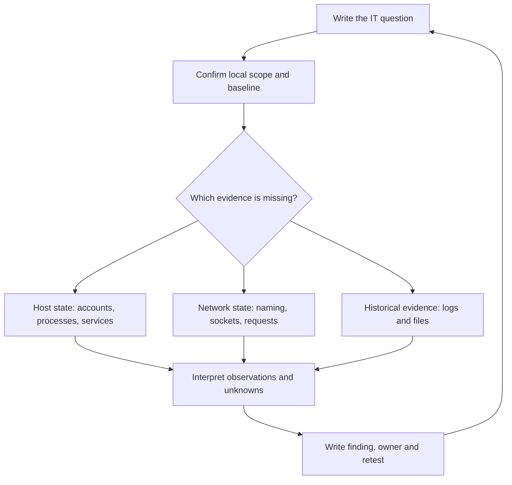

# MERCURY · IT and Team Foundations

Start here if the research flightbooks feel advanced. Learn to explain an ordinary computer, read a tool's output, and write a useful finding before choosing a security tool.

| Read | What you will be able to explain |
|---|---|
| [IT fundamentals](IT.md) | Accounts, permissions, services, IP addresses, DNS, HTTP, TLS, logs and backups |
| [Red, blue and purple teams](TEAMS.md) | Who asks the question, who observes it, and who verifies the outcome |
| [Kali Linux orientation](KALI.md) | What Kali supplies, how to set up a learning VM, and how to check a tool's version |
| [Tool field guide](TOOLS.md) | Twenty core tool entries: what they do, how they work, and what their output means |
| [Manual-page guide](MANUALS.md) | How to read `man`, built-in help, options, examples and exit codes |
| [Six practical labs](LABS.md) | Local HTTP, configuration reading, fixture triage, integrity and evidence handoffs |
| [Actual tool screenshots](SCREENSHOTS.md) | Three credited vendor screenshots with interface-reading exercises |
| [Source ledger](SOURCES.md) | Official manuals, inspection dates and source limitations |

The command examples use your local learning machine, a loopback web server or explicitly synthetic records. They connect to the existing [150 assessment modules](../assessment/README.md); they do not replace or renumber any research mission.

## See a real tool first

**Sourced screenshot:** Wireshark Foundation, [User's Guide, Main Window](https://www.wireshark.org/docs/wsug_html_chunked/ChUseMainWindowSection.html), inspected 2026-10-03. Historical upstream example, not a capture performed for this repository. The three panes show progressively deeper views of the same packet. See [screenshot provenance and exercises](SCREENSHOTS.md).

## Choose tools by the question

You are ready for the assessment flightbook when you can identify a tool's input, explain its measurement, name a competing explanation, and give a teammate a reproducible evidence note.

[Public forge source review](../intelligence/CHURCH-FORGE.md) · [Graduate research](../research/README.md)
