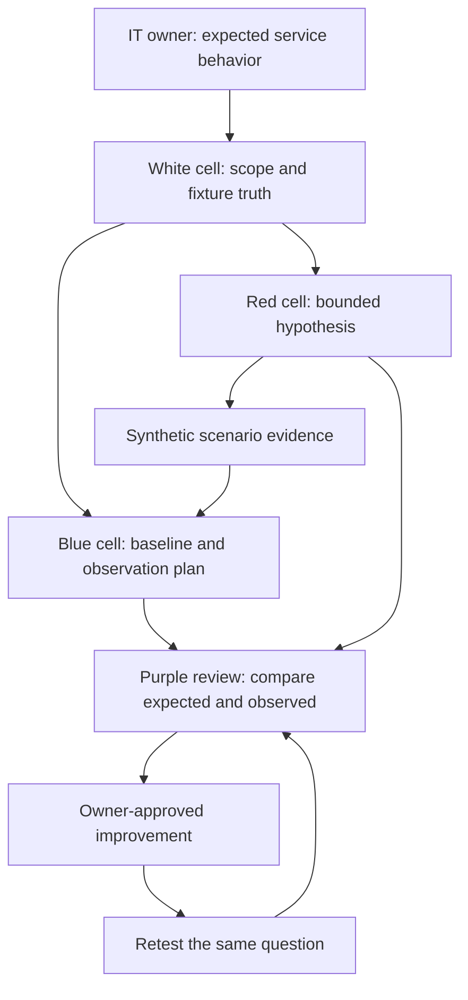

# MERCURY · Red team, blue team and the IT team

A red team challenges a security assumption within an agreed exercise. A blue team observes, investigates, protects and recovers systems. Purple teaming is their deliberate collaboration to improve a measurable defensive outcome. The IT team supplies the actual service context: owners, dependencies, normal maintenance, access policies and recovery expectations. These are roles in a workflow, not permanent labels for people.

| Role | Beginner question | Useful deliverable | Poor success measure |
|---|---|---|---|
| IT/service owner | What must work, and what is normal here? | Baseline, dependency map, restore evidence | Ticket closure without verification |
| Red cell | Which agreed assumption could be wrong? | Bounded scenario, expected observations, evidence note | Number of tools launched |
| Blue cell | What do we know, and what should we do? | Triage timeline, confidence, owner and next observation | Alert count alone |
| Purple collaboration | Can the same evidence improve the control? | Revised detection or process with a retest | A meeting without an outcome |
| White cell/exercise lead | Is this exercise in scope and fairly measured? | Scenario truth, stop decision, adjudication | A surprising demonstration alone |

The existing [assessment protocol](../assessment/PROTOCOL.md) supplies engagement and evaluation references. The comparison below is an author-designed teaching exercise, not a universal certification definition.

## One beginner scenario, several views

**Fictional scenario:** an approved local training service emits three denied sign-ins, then a permitted sign-in and a successful health check. The red cell asks whether the defender can distinguish harmless repetition from a security incident. The blue cell reviews the synthetic record without being told the interpretation. The white cell keeps the scenario note and checks the evidence. The IT owner explains the service baseline.

A denial can mean a typo, stale credentials, policy enforcement or malicious activity. A permitted sign-in does not by itself resolve which explanation is correct. The exercise succeeds when the team identifies both the observed pattern and what further context would discriminate it.

## Assessment, penetration test and red-team exercise

A configuration assessment can compare settings with a policy. A penetration test investigates whether scoped weaknesses can produce a concrete security consequence. A red-team exercise typically examines broader objective-driven behavior and organizational detection/response. Different organizations use these terms differently: the signed scope and permitted actions define the engagement, not the title. This introductory track teaches observation and evidence rather than exploit execution.

## Write the handoff

Use [the finding template](fixtures/finding-template.md). Include the question, scope, timestamp/timezone, input, tool/version, exact observation, interpretation, alternate explanation, service impact, owner, proposed action and retest. Share only the evidence necessary for the decision.

Begin with [RT001](../assessment/modules/RT001.md), [RT007](../assessment/modules/RT007.md), [RT021](../assessment/modules/RT021.md), [RT024](../assessment/modules/RT024.md) and [RT036](../assessment/modules/RT036.md).
