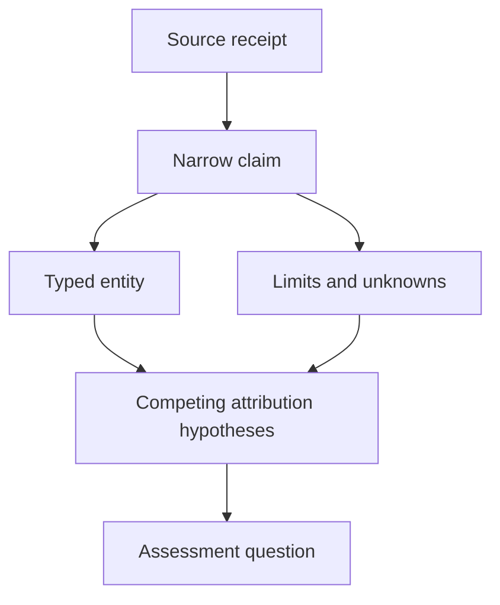

# Public threat and research-persona documentation

A dossier is a set of claim/source relationships, not a verdict about a person. Public handles, organizational brands, vulnerability names, malware names, intrusion operators and government attribution labels are distinct entity types. Store a claimed alias link with its issuer and date; do not merge identities from similar handles, shared code, a hosting relationship or third-party repetition.

## Claim contract

The machine-readable ledger records claim ID, source ID, subject, narrow statement, evidence type, limitation and review date. The source registry records publisher, URL, publication date when known, retrieval date, source class and inspection status. A publication date of null is intentional. Reviewed today does not mean observed today. A government attribution statement is attributed to the agency; an organizational homepage supplies self-published claims; an incident responder supplies reported observations within its coverage.

For probability-like confidence values, use a calibrated method and labeled evaluation first. The current ledger uses categorical evidence types instead of invented numeric confidence. Reposts and summaries do not count as independent observations. Preserve contradictory claims and source-age limits.

## Persona and intrusion separation

The Nightmare-Eclipse card concerns a public research persona. The Huntress source concerns an observed intrusion in which public tooling was used. Those statements do not identify the author as the intruder. An unsuccessful observed attempt also does not prove a tool never works. Historical patch status in a report must not be turned into current endpoint posture.

The Church of Malware card records a self-described community and public homepage bylines. The homepage alone does not independently establish nonprofit status, legal responsibility, organization membership or malicious intent. The retained handles are public bylines, not personal investigations. The ledger supplies no real names, private contacts, home addresses, account triangulation or leaked material.

## From intelligence to assessment

Translate a supported behavior-level claim into an observation requirement, a rival benign explanation and a controlled evaluation question. Example: a report of tool adoption motivates studying protection-health visibility and evidence integrity; it does not justify reproducing a security-product exploit. A help-desk-focused advisory motivates a consented identity-verification tabletop. Public intelligence supplies context, not authority to assess someone else's systems.

A future dossier must add source-version pinning, claim review expiry, corrections and independent review. These cards are an initial bounded evidence register, not a complete actor encyclopedia, a membership directory or a claim of contemporary operational intelligence coverage.
