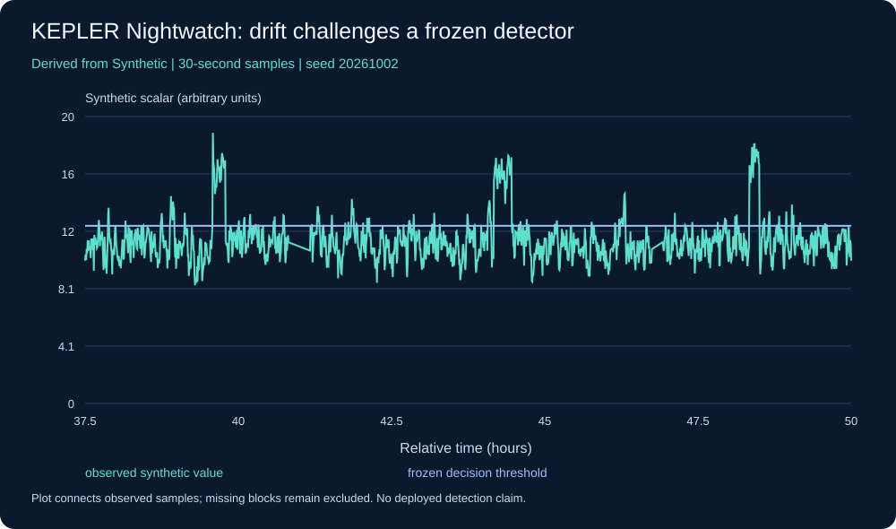
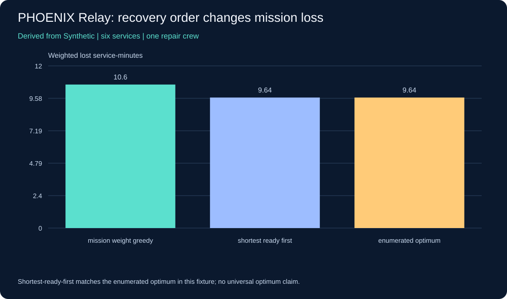
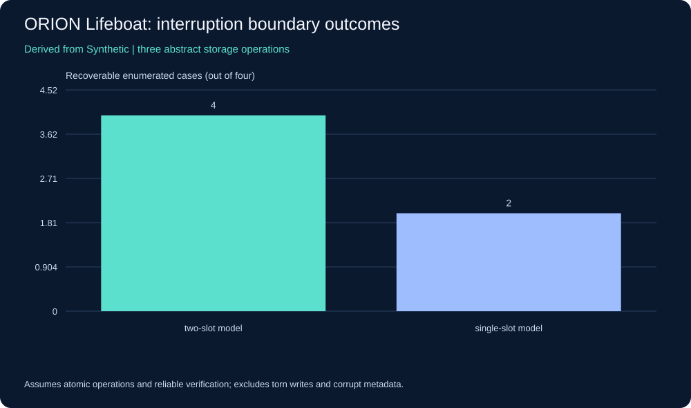
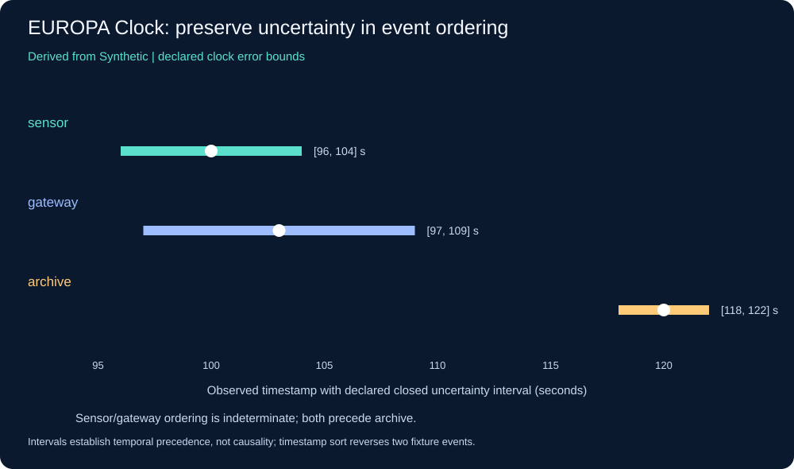
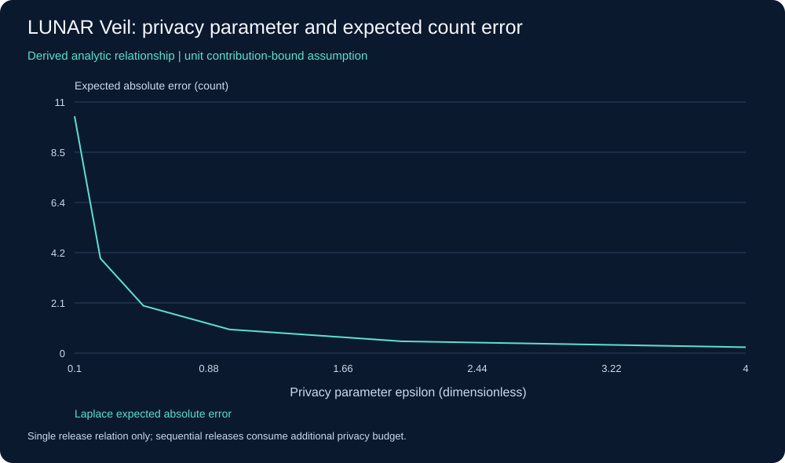
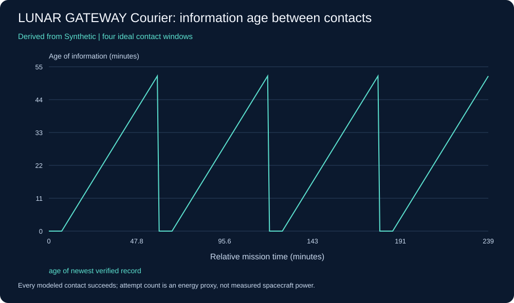
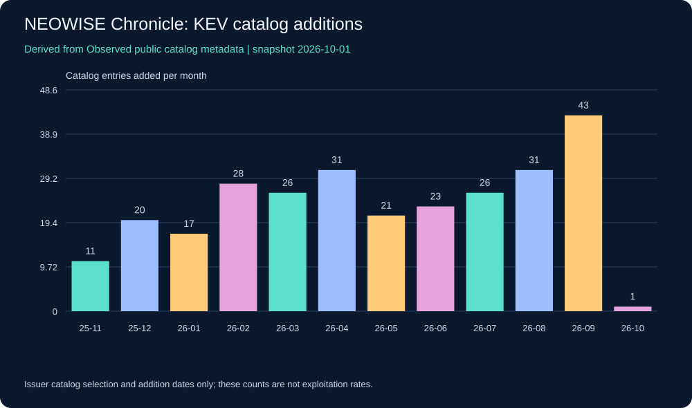

# Reference experiments and measured limits

These six offline experiments use Python's standard library. They exercise bounded mechanics; they are neither completed HELIOS missions nor evidence of deployed defense effectiveness. Synthetic outputs, seed, schema, assumptions and hashes are retained under [data/synthetic](../data/synthetic). The seventh figure derives from the issuer-maintained CISA metadata snapshot.

```bash
python -m experiments.benchmark
python scripts/build_research_visuals.py
python -m unittest discover -s tests -v
```

## KEPLER Nightwatch · detector evaluation



6,000 synthetic samples at 30-second intervals use correlated noise, declared anomaly intervals, two missing blocks and a benign test-period mean shift. Training covers samples 0–2999, validation 3000–4499 and test 4500–5999. Mean/std and median/MAD scores use training parameters; the 99.75th percentile threshold uses labeled benign validation samples. This calibration is supervised, not unsupervised.

The test contains 1,440 observed samples and 80 labeled anomalous samples. Both methods produce 80 true positives and 127 false positives: precision 0.386, timestamp recall 1.0 and 10.58 false alerts per observed hour. They have identical decisions because both scores are monotone affine transformations and use the same percentile criterion. This comparison cannot demonstrate an advantage from robust normalization. All three synthetic events are detected at their first available sample. These outcomes depend on deliberately strong injected anomalies and say nothing about real incident detection.

The 200-replicate, 50-row block-bootstrap precision interval is approximately [0.000, 0.618]. Zero can occur when sampled blocks include no anomalies but do include false alerts. This is a finite-fixture diagnostic with only three test events, not a credible universal performance guarantee. The drift challenge, missingness, event scoring and false-alert denominator matter more than claiming success from high recall.

## PHOENIX Relay · constrained recovery scheduling



Enumerating six synthetic repair jobs yields 25 prerequisite-feasible schedules. The mission-weight greedy baseline loses 10.60 weighted service-minutes; shortest-ready-first and exhaustive optimization both lose 9.64. The optimum is exact only for this six-job, deterministic, single-crew objective. No claim is made about multi-crew, uncertain-duration or real incident recovery. Extend the model with common repair dependencies and held-out duration scenarios before drawing operational conclusions.

## ORION Lifeboat · update interruption boundaries



The two-slot model can select a verified image at all four complete-operation interruption boundaries; a single-slot model can do so in two. This result assumes atomic individual operations, reliable verification and slot availability. The code does not implement secure boot, signature verification, torn-write handling, flash emulation or protection against simultaneous storage failure. Those are falsification tasks for the graduate mission rather than hidden claims of the reference model.

## EUROPA Clock · partial temporal order



Naively sorting two observer timestamps puts sensor before gateway, while fixture truth has gateway first. Their uncertainty intervals overlap, so the interval model returns indeterminate. Both intervals precede archive. Closed intervals that merely touch remain indeterminate. Bounds are assumed and contain the fixture truth; the reference cannot estimate unknown clock bias or establish causation.

## LUNAR Veil · privacy and utility relation



For a unit-bounded count query, Laplace expected absolute error equals sensitivity/epsilon. Twelve sequential releases have a basic composed budget of 12 epsilon. This analytic curve implements no data-release mechanism, protected data ingestion, clipping, secure randomness or production privacy accountant. A future experiment must define the protected entity and contribution limit before invoking a privacy guarantee. See [NIST SP 800-226](https://csrc.nist.gov/pubs/sp/800/226/final).

## LUNAR GATEWAY Courier · contact-limited evidence



A four-hour fixture assumes an eight-minute contact in each hour, with ideal verified delivery at every connected sample. It produces 32 contact-only attempts versus 240 always-attempt steps, with maximum information age 52 minutes. Attempts are an energy proxy, not joules. Queue capacity, signature checks, stale receipts, packet loss and real spacecraft contacts remain unimplemented.

## NEOWISE Chronicle · real metadata, narrow interpretation



The [snapshot](../data/research/kev_snapshot.json) retains 1,731 KEV entries from catalog release 2026-10-01. Five public metadata fields are retained; source commit, original-input SHA-256 and acquisition date identify provenance. The figure shows the last twelve addition-month bins, including the partial current month. Counts describe catalog additions, not attacks, victim counts, exploitation onset or overall vulnerability prevalence. Unlisted CVEs are not negative labels. The publisher's [mirror and CC0 scope](https://github.com/cisagov/kev-data) support this metadata use.
