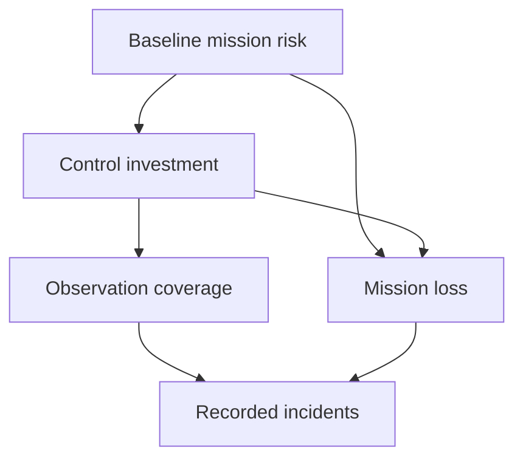

# HELIOS graduate research protocol

A credible cyberengineering result connects mission consequence to a defensible mechanism, an observation model and an experiment that can fail. This extension preserves missions 001–150 and adds proposed missions 151–180. Six small executable reference models test mechanics; they do not implement the complete missions or establish field effectiveness. The new mathematics is an author-proposed research formulation, not a formula mandated by the cited standards.

## State the claim before selecting a tool

Specify the population, system boundary, intervention, comparator, endpoint and minimum meaningful effect. For a telemetry detector, an example endpoint is fewer false alerts per observed sensor-hour at a fixed event-recall floor. A latency endpoint must state whether time begins at event onset, first available observation or analyst receipt. For recovery, define lost service-minutes and finite staffing. For proofs, separate a reachable finite-state violation from an unbounded theorem and from implementation conformance.

| Record | Required content | Review question |
|---|---|---|
| Mission requirement | Essential function, owner, demand and consequence | Which decision changes if the research succeeds? |
| Threat and fault model | Allowed actor capabilities abstractly; benign faults, environmental conditions and trust assumptions | Could a benign process produce the same observation? |
| Observation model | Sensor coverage, timestamps, sampling, missingness and label source | What cannot be inferred from absence? |
| Mechanism | Variables, units, state transitions, interfaces and objective | Does the implementation actually test this mechanism? |
| Comparator | Operational practice and simple credible baseline | Are information, compute and tuning budgets equal? |
| Falsifier | Result that rejects the thesis | Is failure reported as openly as success? |
| Resource contract | RAM, storage, analyst-hours, energy and external dependencies | Is the proposed system feasible under actual constraints? |

## Statistical design

Split by time, host/channel, artifact family, team or failure scenario as appropriate. Never randomly split overlapping windows and then describe the test set as independent. Keep transformation fitting, hyperparameter selection and threshold selection inside training/validation. Predeclare a final untouched test partition and record every reuse. In rare-event detection, report prevalence, precision, recall, false-positive rate and alert burden together; high accuracy can reflect always predicting the majority class.

For Bernoulli outcomes, justify sample size from the intended interval width or detectable effect, then adjust for correlated units and event scarcity. A rough independent-event planning relation is $n \approx z_{0.975}^2 p(1-p)/h^2$, where $h$ is the desired half-width; it is not adequate for clustered telemetry or sparse zero-error results. Zero failures does not demonstrate zero risk: the independent-trial upper-bound heuristic is approximately $3/n$ at 95%, and dependence makes effective $n$ smaller. Use scenario/team/channel-level resampling when observations share causes. The included 50-row block bootstrap is an illustrative finite-fixture diagnostic; justify block duration from the correlation structure for real data.

Paired interventions on the same scenarios reduce nuisance variation. Report effect size with uncertainty and a resource-normalized comparator, not a p-value alone. For 180 proposals, do not interpret many exploratory significant results as 180 confirmations: preregister confirmatory endpoints, label exploratory analyses and choose a multiplicity strategy before inspecting the outcomes. A non-significant result does not establish equivalence; an equivalence claim requires a prespecified acceptable difference and suitable test.

## Identification and causal interpretation

A useful causal study distinguishes intervention selection, observation availability and the outcome. This proposed diagram makes a common failure visible:

Recorded incidents may increase when observation improves even while mission loss decreases. A before/after plot alone cannot distinguish that effect. Write the adjustment set and justify overlap, intervention consistency, interference and the missingness mechanism. If assumptions cannot be defended, provide sensitivity bounds or descriptive associations. A detector disagreement, physical residual or catalog membership is not causal attribution of malicious behavior.

## Graduate challenges that deserve experiments

1. **Partial observability:** distinguish unknown state from favorable state; explicitly model missed sensors and incomplete labels.
2. **Nonstationarity:** hold out operating modes, calendar periods and device families; evaluate adaptation against a frozen baseline without learning from future labels.
3. **Compositional assurance:** connect a proof, build digest and hardware/environment assumption to the same evaluated revision; one valid component does not establish system validity.
4. **Common causes:** model shared power, keys, clocks, suppliers and operator availability. Multiplying component availability assumes independence that often needs evidence.
5. **Identifiability:** determine which parameters can be learned from the chosen observations before optimizing them. Strong regularization cannot manufacture missing information.
6. **Tail risk:** compare mean loss and a declared tail metric; uncertain heavy-tailed restore times can reverse a seemingly optimal schedule.
7. **Human coupling:** workload, accessibility, handoffs and incentives affect measured outcomes. Use consent, blinded grading and team-level dependence in human studies.
8. **External validity:** compare source and target environments explicitly. Historical telemetry and laboratory fixtures do not establish contemporary deployment performance.

## Delivery gates

| Gate | Reviewable artifact | Exit criterion |
|---|---|---|
| G0 concept | Thesis, scope, source ledger, rival mechanism | Distinct scientific question and observable endpoint |
| G1 formalization | State/schema, units, assumptions, identifiability analysis | An independent reviewer can reconstruct the claim |
| G2 reference model | Fixture, baseline, adverse cases and deterministic outputs | Known analytical or fixture truth checks pass |
| G3 benchmark | Pinned lawful data, untouched partition, uncertainty and ablations | Results survive declared comparisons and negative controls |
| G4 isolated pilot | Resource use, task success, rollback and owner approval | All local safety/privacy/availability requirements hold |
| G5 operational study | Monitored deployment and independent review | Evidence supports the narrow stated population and conditions |

This change reaches G2 for six mechanics only. The individual missions remain G0–G1 proposals. Dataset acquisition beyond the KEV metadata snapshot, complete systems, independent scientific review, human studies and operational pilots remain future work.

## Reading path and source roles

[NIST SP 800-160 Vol. 2 Rev. 1](https://csrc.nist.gov/pubs/sp/800/160/v2/r1/final) grounds resilience objectives and systems-engineering context. [NASA-STD-8739.8B](https://standards.nasa.gov/standard/nasa/nasa-std-87398) grounds software assurance, safety and independent verification responsibilities. [NIST SP 800-226](https://csrc.nist.gov/pubs/sp/800/226/final) grounds evaluation of differential-privacy claims. These sources guide design review; they do not validate the proposed algorithms, provide cyber-event frequencies or endorse HELIOS.
